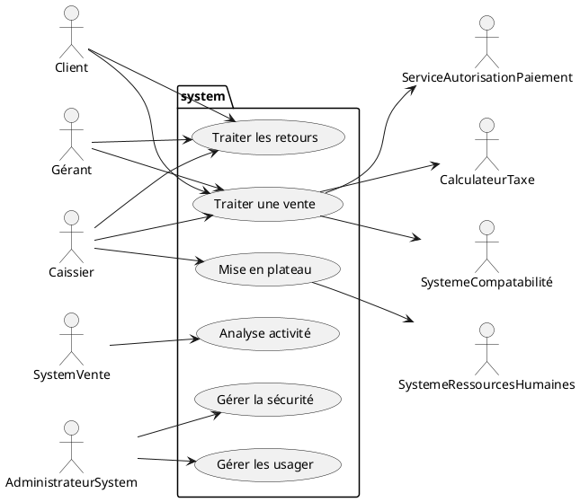
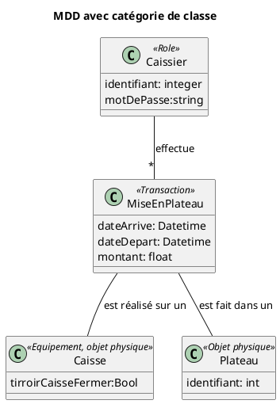
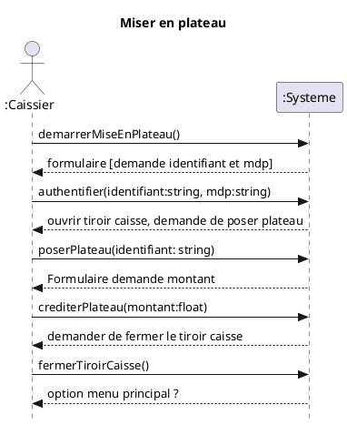
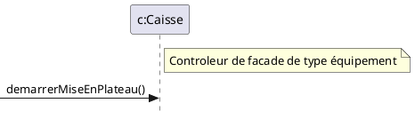
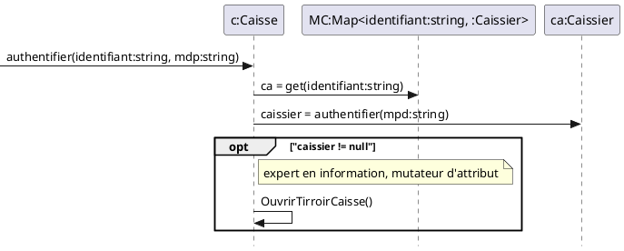
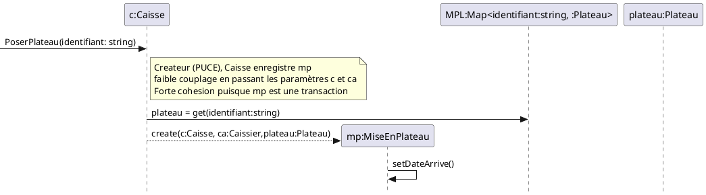
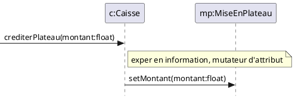
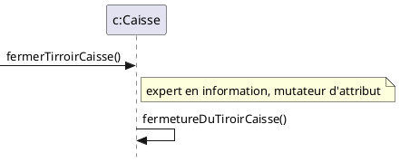
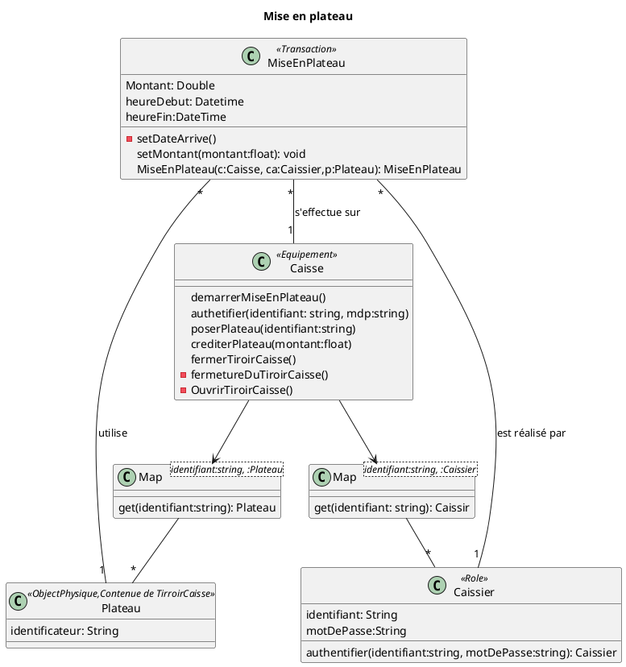

# Système de caisse enregistreuse

### Diagramme des cas d'utilisation

# UC03 : Mise en plateau
Acteur principal : Caissier
- **Préconditions :**
La caisse est libre et son tiroir-caisse est vide (il n’y a pas de plateau dedans).
- **Garanties de succès (postconditions)**
Le caissier est authentifié. Le plateau du caissier est inséré dans le tiroir-caisse et son identificateur est enregistré. Le montant d’argent du plateau est enregistré. L’heure de l’arrivée du caissier est enregistrée.

#### Scénario principal (succès)
1. Le Caissier arrive à la caisse avec son plateau d’argent.
1. Le Caissier saisit son identifiant et son mot de passe.
1. Le Système authentifie le Caissier.
1. Le Système ouvre le tiroir-caisse et demande au Caissier de poser son plateau dans le  tiroir-caisse.
1. Le Caissier pose son plateau dans le tiroir-caisse.
1. Le Système reconnaît l’identificateur du plateau.
1. Le Système demande au Caissier de rentrer le montant d’argent du plateau.
1. Le Caissier rentre le montant d’argent du plateau.
1. Le Système demande au Caissier de fermer le tiroir-caisse.
1. Le Caissier ferme le tiroir-caisse.

Pose hypothèse qu'une caisse à seulement un tirroir caisse.

## Interface usagé

## MDD

<!-- LOG210-04 seance-02-->
<!-- LOG210-03 seance-02 -->

## DSS

## Contrat

 ## Operation: demarrerMiseEnPlateau()

- Précondition
  - 
- Postcondition

## Operation: authentifier(identifiant:string, mdp:string)
- Précondition
  - ca:Caisse existe (puique la transactions se fait sur cette caisse)
  
- Postcondition
  - c.tirroirCaisseOuvert est devenu true

## Operation: poserPlateau(identifiant:string)
- Précondition
  
- Postcondition
  - Une instance mp:MiseEnPlateau a été créée
  - mp.dateArrivé est devenu maintenant
  - Une associatation entre Caissier et mp:MiseEnPlateau a été créée sur la base de correspondance avec Caissier.identifiant == identifiant et Caissier.mdp == mdp
  - Une association entre ca:Caisse et mp:MiseEnPlateau a été créée
  - Une association entre Plateau et Mp:MiseEnPlateau à été créée sur la base de correspondance avec Plateau.identifiant == identifiant

## Operation: crediterPlateau(montant:string)
- Précondition
  - mp:MiseEnPlateau existe
- Postcondition
  - mp.montant est devenu montant

## Operation: fermerTiroirCaisse()
- Précondition
  - 
- Postcondition
  - c.tirroirCaisseOuvert est devenu false

## RDCU's

### RDCU - demarrerMiseEnPlateau
Question pour trouver le controleur de facade:
  - objet racine, équipement, systeme globale, sous-système
  - 

### RDCU authentifier

### RDCU PoserPlateau

### RDCU crediterPlateau

### RDCU fermerTirroirCaisse

## DCL/DCC

<!--LOG210-03 fait en classe-->