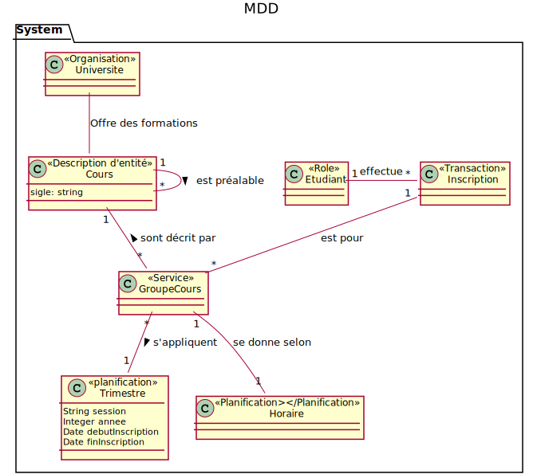
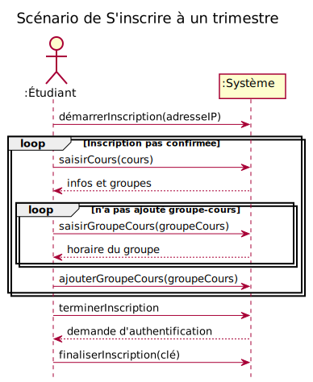

# Système d'inscriptions à des cours

## MDD Inscription a des cours avec catégorie de classe

### DSS

### Contrat CU01-démarrerInscription
**Opération :** démarrerInscription(adresseIP : String)
**Préconditions :** aucune
**Postconditions :**
- une instance ins d’Inscription a été créée
- ins.adresseIP est devenu adresseIP

### Contrat CU01-saisirCours(cours)
**Opération :** saisirCours(cours :String)
**Préconditions :** 
- une inscription est en cours

**Postconditions :**
- aucune 

### Contrat CU01-saisirGroupeCours
**Opération :** saisirGroupeCours(groupeCours :String)
**Préconditions :** 
- une inscription est en cours

**Postconditions :**
- Aucune

### Contrat CU01-ajouterGroupeCours
**Opération :** ajouterGroupeCours(groupeCours :String)
**Préconditions :** 
- une inscription est en cours
**Postconditions :**
- une association entre ins et GroupeCours a été formée sur une base de correspondance avec groupeCours.

### Contrat CU01-terminerInscription
**Opération :** terminerInscription
**Préconditions :** 
-  une inscription est en cours

**Postconditions :**
- aucune 

### Contrat CU01-finaliserInscription
**Opération :** finaliserInscription (clé :String)
**Préconditions :** 
- une inscription est en cours

**Postconditions :**
- une association entre ins et Étudiant a été formée
- ins.dateHeure est devenu la date et heure actuelle.

# RDCU's inscription cours université
## CU01-RDCU-demarrerInscription

## CU01-RDCU-saisirCours

## CU01-RDCU-saisirGroupeCours

## CU01-RDCU-ajouterGroupeCour

## CU01-RDCU-terminerInscription

## CU01-RDCU-finaliserInscription

## DCL

