# Système d'inscriptions à des cours

## MDD Inscription a des cours avec catégorie de classe

### DSS

### Contrat CU01-démarrerInscription
**Opération :** démarrerInscription(adresseIP : String)
**Préconditions :** aucune
**Postconditions :**
- une instance ins d’Inscription a été créée
- ins.adresseIP est devenu adresseIP

### Contrat CU01-saisirCours(cours)
**Opération :** saisirCours(cours :String)
**Préconditions :** 
- une inscription est en cours

**Postconditions :**
- aucune 

### Contrat CU01-saisirGroupeCours
**Opération :** saisirGroupeCours(groupeCours :String)
**Préconditions :** 
- une inscription est en cours

**Postconditions :**
- Aucune

### Contrat CU01-ajouterGroupeCours
**Opération :** ajouterGroupeCours(groupeCours :String)
**Préconditions :** 
- une inscription est en cours
**Postconditions :**
- une association entre ins et GroupeCours a été formée sur une base de correspondance avec groupeCours.

### Contrat CU01-terminerInscription
**Opération :** terminerInscription
**Préconditions :** 
-  une inscription est en cours

**Postconditions :**
- aucune 

### Contrat CU01-finaliserInscription
**Opération :** finaliserInscription (clé :String)
**Préconditions :** 
- une inscription est en cours

**Postconditions :**
- une association entre ins et Étudiant a été formée
- ins.dateHeure est devenu la date et heure actuelle.
- une association entre ins et GrandLivre a été formée

### CU01-RDCU-demarrerInscription

Pour la réponse à cette question, nous commençons avec la première opération système que l’on trouve dans le DSS. C’est démarrerInscription :

N.B. La solution pour démarrerInscription sera présentée en étapes, pour mieux comprendre un processus de RDCU. Ce n’est pas un processus « propre » où on voit tout de suite la solution finale. La conception est souvent un processus « bâclé ». On décompose un problème en sous-problèmes et on les relie ensemble, par exemple. Les solutions pour les autres opérations système seront plus courtes, mais impliquent un processus similaire.

La première étape dans toute RDCU est de déterminer quel objet de la couche-domaine va recevoir l’opération système (dans ce cas, démarrerInscription) :

**GRASP Contrôleur :**
Quel est le premier objet en dehors de la couche présentation qui reçoit et coordonne (« contrôle ») les opérations système ?

Affectez une responsabilité à la classe qui correspond à l'une de ces définitions :
- Elle représente le système global (contrôleur de façade).
- un « objet racine »(contrôleur de façade).
- un équipement (contrôleur de façade).
  un sous-système (contrôleur de façade).
- Elle représente un scénario de cas d'utilisation dans lequel l'opération système se produit (contrôleur de session ou de cas d'utilisation).

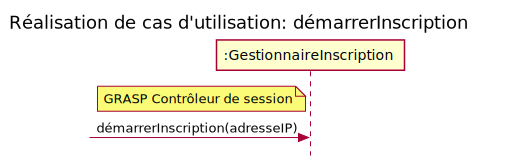

En suivant le point 1 de Contrôleur, essayons de trouver un « objet racine » dans le modèle du domaine. Y a-t-il un objet représentant un équipement ou un sous-système? Dans l’exemple du livre, il y a une classe conceptuelle « Registre » qui est en effet un équipement. Cependant, dans notre modèle du domaine en annexe, il n’y a pas d’objet racine. Alors, nous devons suivre le point 2 pour déterminer l’objet contrôleur. C’est-à-dire utiliser un contrôleur de session. Appelons cet objet « GestionnaireInscriptions » puisque Gestionnaire est un nom fréquemment utilisé pour les contrôleurs de session et Inscriptions est l’objet du cas d’utilisation dans lequel on travaille en ce moment. 

Cette prise de décision donne le résultat suivant, qui est un diagramme de séquence UML démontrant l’opération système qui arrive sur le contrôleur. Toute RDCU commence par cette étape. Notez que la décision GRASP est annotée dans la note du diagramme :

Pour la suite de cette RDCU, il faut satisfaire toutes les postconditions du contrat correspondant à l’opération système. Le contrat est dans l’annexe, mais on le répète ici :

**Contrat C01 : démarrerInscription**
**Opération :** démarrerInscription(adresseIP : String)
**Préconditions :**
- aucune
**Postconditions :**
- une instance ins d’Inscription a été créée
- ins.adresseIP est devenu adresseIP

Les deux postconditions peuvent être considérées comme l’initialisation d’une instance de Inscription. Là, il s’agit de créer une instance de l’objet Inscription en passant l’adresse IP comme argument. Cela veut dire que quelque part dans la RDCU, il y aura un élément comme la figure suivante :

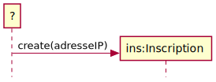

Cependant, la classe qui instancie « ins :Inscription » n’est pas encore déterminée, car on voudrait suivre les principes GRASP avant de prendre une décision erronée. Alors, quel GRASP s’applique lorsqu’il s’agit de créer une instance? On peut poser la question autrement : qui prend la responsabilité de créer l’instance « ins »? 

**Rappelons le GRASP Créateur :**

**Qui crée ?** (Notez que Fabrique Concrète est une solution de rechange courante.)
Affectez à la classe B la responsabilité de créer une instance de la classe A si l'une des assertions suivantes est vraie :
1. B **P**ossède A
2. B **U**tilise étroitement A
3. B **C**ontient A
4. B **E**nregistre A
5. B agrège A
6. B a les données pour initialiser A

Dans notre cas, la classe A est « Inscription » et nous devons décider la classe B qui va l’instancier. Alors, y a-t-il des classes dans le modèle du domaine (question 4) qui répondent à une ou à plusieurs assertions de Créateur?

Qui « contient » ou « agrège » ou « a les données pour initialiser » ou « enregistre » ou « utilise étroitement » Inscription?

On voit dans le modèle du domaine que GrandLivre agrège/contient/enregistre des Inscriptions. Alors, il pourrait être un candidat pour le créateur. Les seules autres classes liées à Inscription sont Étudiant et GroupeCours. Étudiant agrège une inscription, mais pas de la même façon que GrandLivre. GroupeCours n’agrège pas Inscription (c’est le contraire). 

Conclusion : <s>GrandLivre</s> ControleurInscription est, selon le principe GRASP Créateur, la bonne classe pour instancier les nouvelles Inscription. On peut proposer cette partie de la RDCU, indiquée dans la figure suivante avec une annotation de notre décision :

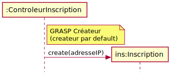

Maintenant, il faut combiner les deux parties (le partie contrôleur et la partie créateur) pour compléter la RDCU :

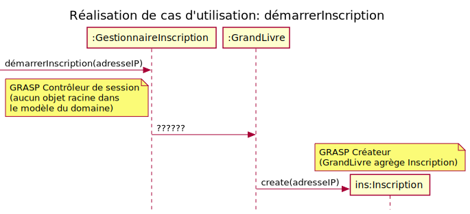

Il y a juste un problème – le flot de contrôle doit passer du GestionnaireInscription au GrandLivre, indiqué par le message « ????? » au milieu de la figure. Nous devons proposer une méthode que GrandLivre va implémenter pour faire le travail d’instanciation d’Inscription. De plus, GestionnaireInscription devrait « voir » la référence ins, car cette information sera probablement utilisée plus tard dans une autre opération système. GestionnaireInscription gardera cette information pour la durée de la session.

Pour compléter la RDCU, on propose une méthode addInscription(adresseIP) implémentée dans GrandLivre. Voici la RDCU finale pour l’opération système. Notez que nous avons ajouté le principe GRASP Expert à la deuxième annotation, car la méthode addInscription est naturellement justifiée par Expert  :

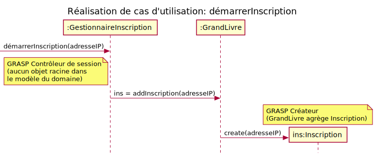

Pour terminer cette RDCU, nous pouvons faire une vérification des éléments :
- contrôleur GRASP a été annoté
- toutes les postconditions du contrat ont été satisfaites
- toutes les décisions ont été justifiées par (au moins) un GRASP

N.B. dans le cas d’utilisation, il y a mention des informations retournées par l’opération système : « 3. Le système affiche les cours offerts pour lesquels l’étudiant a réussi les cours préalables. »Cependant, la complexité de cette étape nuit à l’objectif pédagogique de cet exercice et donc elle serait ignorée.

[considérer les informations retournées comme un détail avancé]

Faisons les RDCU pour le reste des opérations systèmes.

### CU01-RDCU-saisirCours

Notez que l’on utilise toujours le même contrôleur GRASP pour toutes les opérations système dans le même cas d’utilisation. 

Bien qu’il n’y ait pas de postcondition dans le contrat de saisirCours, il faut que la conception tienne compte du bon comportement (la fonctionnalité spécifiée dans le cas d’utilisation). On voit bien dans le DSS que le résultat doit être l’affichage d’une liste de groupes offerts pour le cours en question. Pour réaliser ce comportement, il est nécessaire de rechercher des informations, grâce à la relation entre Cours et GroupeCours. 

On doit effectivement trouver la référence à une instance de Cours correspondant à l’argument cours qui est une String. Par exemple, si cours = « LOG210 », alors il faut repérer l’objet Cours pour lequel l’attribut titre = « LOG210 ». Larman fait référence à ce genre de recherche comme un idiome (ou patron de programmation) qui s’appelle « Transformation des identifiants en objets » à la page F.451 (ou « IDs to Objects » à la page A.460).

Pour comprendre l’utilisation de l’instance de Map<Cours>, voir la section « Recherche d’une DescriptionProduit » à la page 333, ainsi que la figure 17.7 à la page 334. 

La méthode Cours.getGroupes() retourne un Map<GroupeCours>, car c’est l’ensemble des GroupeCours associé à l’objet c :Cours.

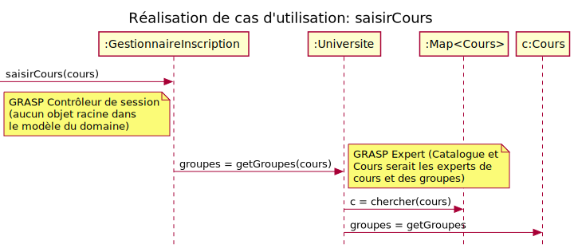

L’explication qui suit est une parenthèse pour comprendre la conception avec un :Map. Elle ne fait pas partie d’une RDCU. Considérer la relation entre CatalogueCours, Cours et GroupeCours :

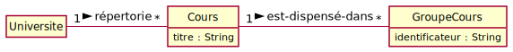

Pour donner un exemple concret où il y a 3 cours dans le catalogue, on utilise un diagramme d’objet en UML :

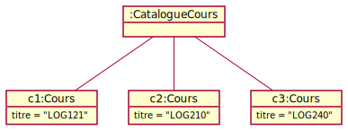

Alors, lorsqu’on agrège des objets, dans la conception on considère l’utilisation d’une collection comme une List ou une Map. On pourrait même utiliser un simple tableau. Lorsqu’on doit repérer ces objets par une clé unique (p.ex. le titre du cours), il est pratique d’utiliser une Map. Si vous avez oublié ces notions, il est important de les revoir dans le tutoriel de Java ou dans le livre de LOG121 ou même INF111. 

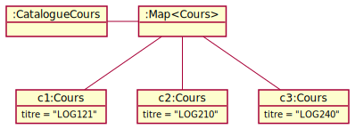

### CU01-RDCU-saisirGroupeCours

Il n’y a toujours pas de postcondition dans le contrat de saisirGroupeCours, mais il doit y avoir l’affichage de l’horaire pour le groupe-cours en question. 

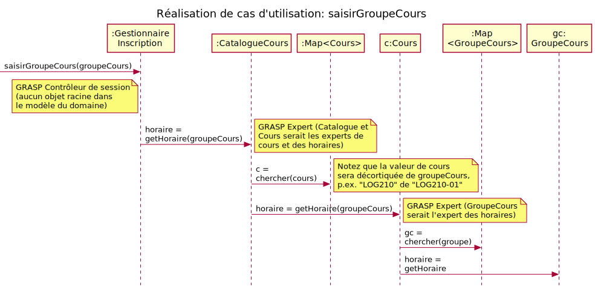

### CU01-RDCU-ajouterGroupeCour

La postcondition contient la phrase « sur une base de correspondance avec groupeCours » ce qui veut dire une recherche de l’objet correspondant à l’argument groupeCours . N’oubliez pas que nous ne pouvons pas utiliser les références aux objets du domaine comme arguments sur les opérations système, car on est limité aux types primitifs (afin de permettre un changement de couche de présentation facilement). 

Notez que ins est toujours « visible » car elle a été stockée par le contrôleur GRASP.

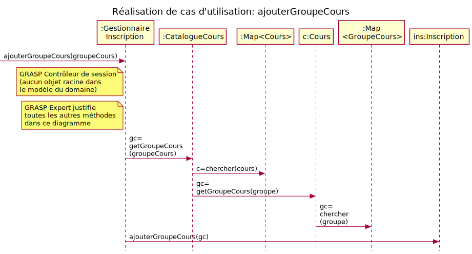

### CU01-RDCU-terminerInscription

Une opération sans postcondition, elle indique la sortie de la boucle. Nous n’avons rien à faire dans la couche domaine, alors il n’y a pas besoin de faire un diagramme de séquence UML pour cette opération. Cependant, ça sera le même contrôleur GRASP qui s’occupe d’enclencher la demande d’authentification dans la couche de présentation.

### CU01-RDCU-finaliserInscription

Cette opération système contient trois postconditions, alors on doit être sûr de les satisfaire.

Normalement on vérifie la clé pour une bonne fonctionnalité dans le cas d’utilisation. 

Notez que e et ins ont été stockés dans le contexte de la session par GestionnaireInscription (contrôleur GRASP). 

### DCL a faire