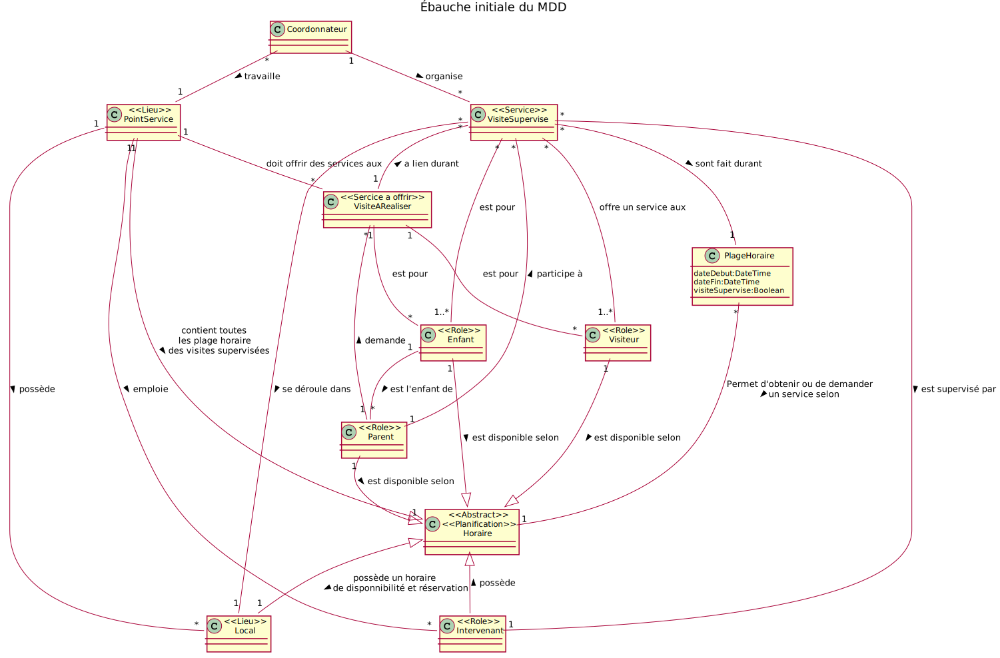
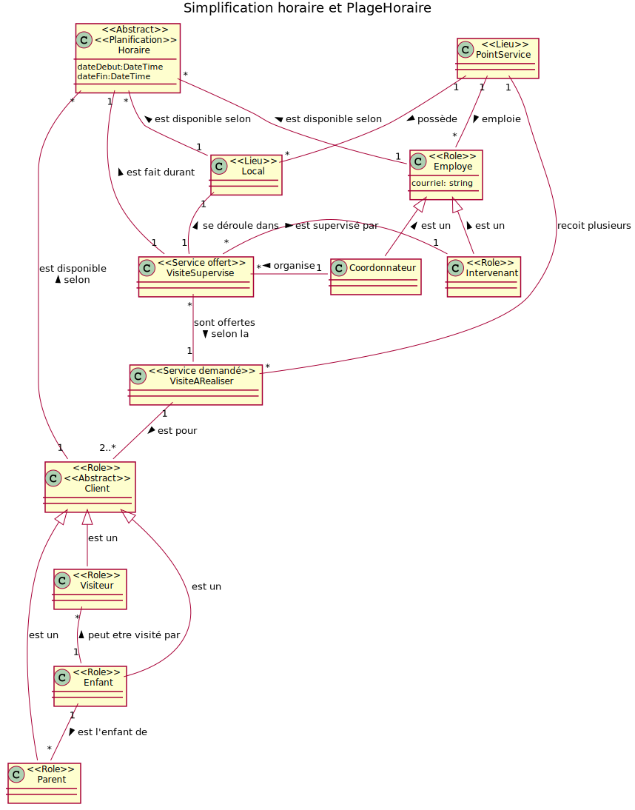
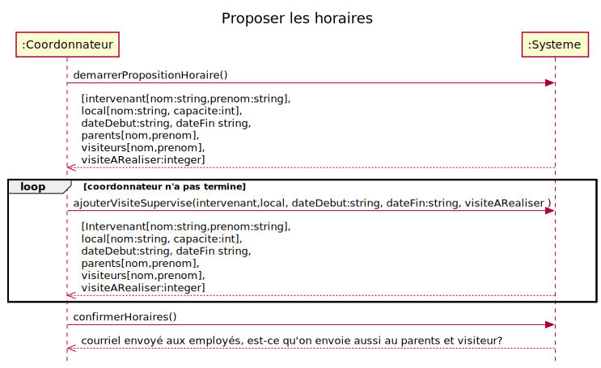
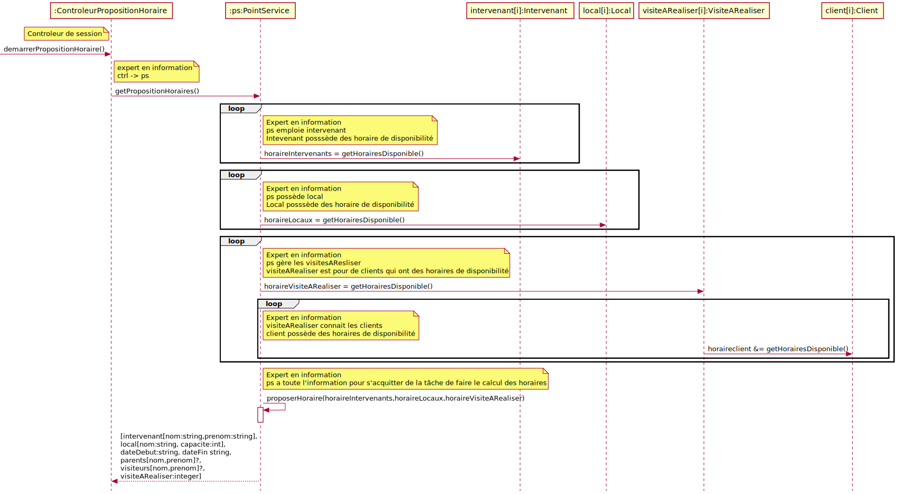
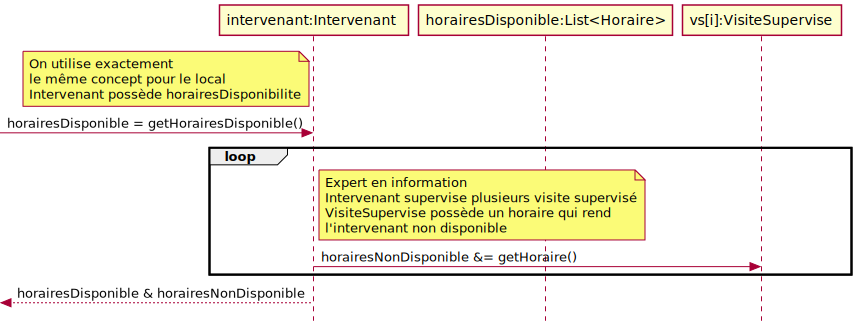
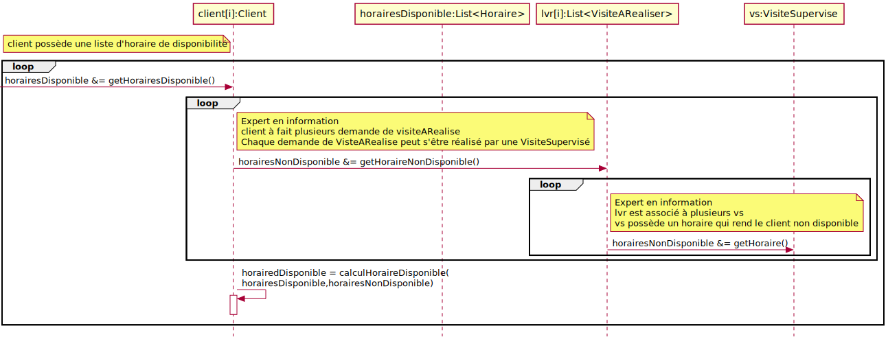
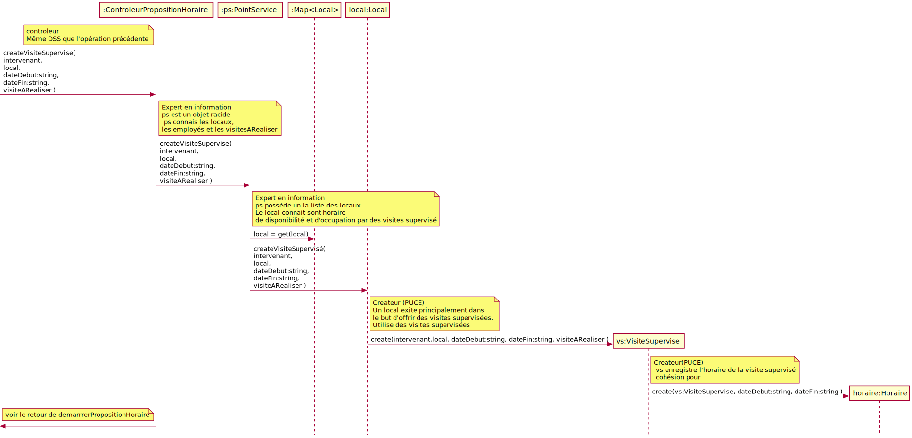
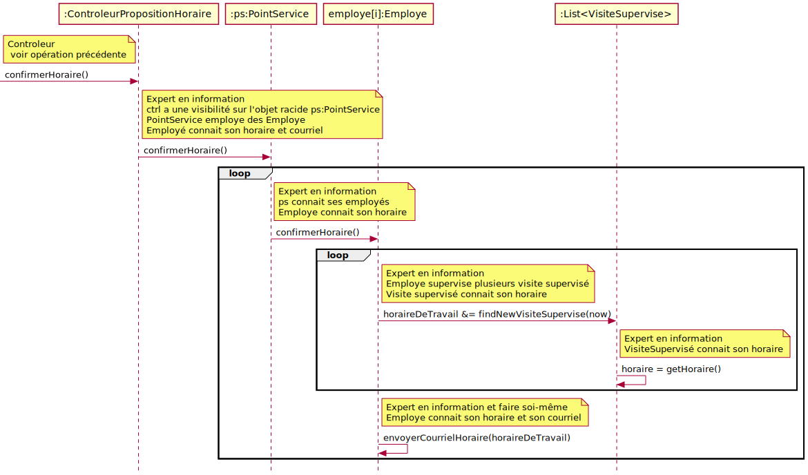

# RQRSDA

## CU026 Proposer les horaires

### Exigence clients
 - [Exigence client](../S20192-LOG210-exigences.pdf) 

## Diagramme de classes V1

Analyse du résultats:  Il y a beaucoup d'association, il faut trouvé un moyen de simplifier.  Il y a plusieurs associations un à un entre Horaire et plusieurs autres classes il faut trouver une solution pour éliminer cette association qui n'a pas de sens.

## Diagramme de classes V2

J'ai utilisé de la généralisation pour éliminer l'association un à un mais en y réfléchissant je constante qu'un Enfant, Visiteur, Parent ...  n'est pas un horaire. Donc cette version n'est pas cohérente.  

Solution remplacer Horaire et PlageHoraire par horaire.   Un Enfant, Visiteur, Parent, ... a plusieurs Horaire de disponibilité avec une date de début et une date de fin.  C'est plus cohérent. 

## Diagramme de classes V3

La généralisation des Clients et Employés réduit considérablement le nombre d'association dans mon MDD. La simplification de Horaire et PlageHoraire améliore aussi la solution.  Il pourrait y avoir une abstraction supplémentaire avec Client et Employé pour les information tel le nom, prénom, courriel... mais comme je n'ai pas encore d'information sur le contenu de chacune des classes je conserve la solution tel quelle.

# Diagramme de séquence

## Contrats

### demarrerPropositionHoraire()
  - Précondition:

  - Postcondition
    - Aucune

### ajouterHoraire(intervenant,local, dateDebut:string, dateFin:string, visiteARealiser )
- Précondition:
    - c:Coordonnateur est authentifier et fait la mise à jour de l'horaire
  - Postcondition
    - Une instance vs:VisiteSupervisé à été créée
    - Une association a été créée entre vs:VisiteSupervisé et c:Coordonnateur
    - Une association a été créée entre vs:VisiteSupervisé et Intervenant sur la base de correspondance avec le paramètre intervenant
    - Une association a été créée entre vs:VisiteSupervisé et Local sur la base de correspondance avec le paramètre local
    - Une instance h:Horaire a été créée
    - h.dateDebut est devenu paramatre dateDebut
    - h.dateFin est devenu paramatre dateFin
    - Une association a été créée entre vs:VisiteSupervisé et h:Horaire
    - Une association a été créée entre vs::VisiteSupervisé et VisiteARealiser sur la base du paramètre visteARealiser

### confirmerHoraires()
 - PostCondition
   - Aucune

# RDCU's

## RDCU demarrerPropositionHoraire

### Comment récupérer l'horaire de l'intervenant

### Comment récupérer l'horaire des clients

## RDCU ajouterVisiteSupervise

## RDCU confirmerHoraire

