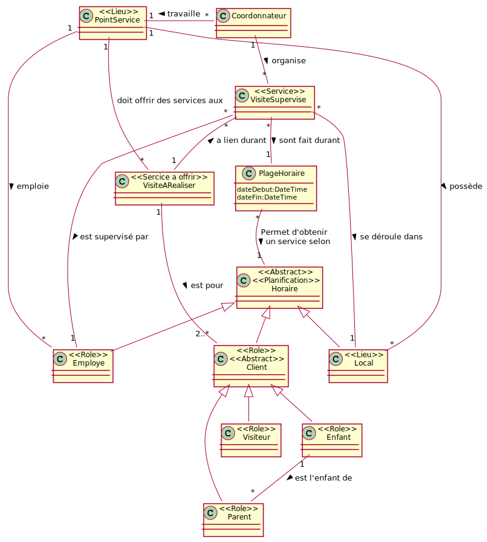
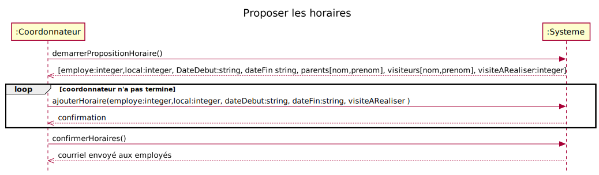

# RQRSDA

# CU026 Proposer les horaires

## Diagramme de classes

# Diagramme de séquence

## Contrats

### demarrerPropositionHoraire()

### ajouterHoraire(employe:integer,local:integer, dateDebut:string, dateFin:string, visiteARealiser )

### confirmerHoraires()
