# Étude de cas jeBouquine

La société (fictive!) jeBouquine a décidé récemment de rejoindre les
rangs des grands libraires francophones en ligne. Les rayons déjà
ouverts sur le site web sont très divers: Informatique, Sciences et
techniques, Psychologie, Décoration et Jardinage. La librairie
jeBouquine assure également la distribution en langue anglaise d'une
large sélection d'ouvrages des plus grands éditeurs anglais et
américains. Par exemple, on trouve dans le rayon informatique des titres
venant de chez Addison-Wesley, McGraw-Hill, O'Reilly, Wiley, Wrox Press,
etc.

L'objectif fondamental du futur site
[www.jeBouquine.com](http://www.jebouquine.com) est de
permettre aux internautes de rechercher des ouvrages par thème, auteur,
mot-clé, etc., de se constituer un panier virtuel, puis de pouvoir les
commander et les payer directement sur le Web.

## Diagramme de cas d'utilisation

TODO

## Cas d'utilisations

### CU01-Maintenir le catalogue

**Acteur principal**

Le Libraire.

**Acteurs secondaires**

Les deux systèmes Nouveautés et Gestion des stocks.

**Objectifs**

Le Libraire veut pouvoir contrôler la mise à jour automatique du
catalogue des ouvrages présentés sur le site web.

**Préconditions**

-   Le Libraire s'est authentifié sur l'intranet (voir le cas
    > d'utilisation S'authentifier).

-   La version courante du catalogue est accessible.

**Postconditions**

Une nouvelle version du catalogue est disponible.

**Scénario nominal**

1.  Le système Nouveautés alimente le site avec les nouveaux ouvrages.

2.  Le système Gestion des stocks met à jour les données qui concernent
    > le prix et l'état du stock.

3.  Le Libraire valide la mise à jour du catalogue.

**Alternatives**

**1-2a** Le Système détecte un dysfonctionnement des systèmes externes
de mise à jour.

1.  Le Système signale le dysfonctionnement au Libraire.

2.  Le Libraire invalide la mise à jour partielle ou erronée et revient
    > à la version précédente du catalogue. Il prévient également le
    > Webmaster pour qu'il engage des actions de maintenance. Le cas
    > d'utilisation se termine en échec.

**3a** Le Libraire détecte des erreurs ou des incohérences parmi les
nouvelles informations.

1.  Le Libraire modifie toutes les informations erronées.

2.  Le Libraire valide la mise à jour du catalogue.

**3b** Le Libraire veut ajouter d'autres informations.

1.  Le Libraire exécute le cas d'utilisation Maintenir les informations
    > éditoriales.

2.  Le Libraire valide la mise à jour du catalogue.

**Exigences supplémentaires**

Le catalogue est mis à jour quotidiennement.

### CU02- Chercher des ouvrages

**Acteur principal**

L'Internaute (qu'il soit déjà client, ou simple visiteur)

**Objectifs**

L'Internaute veut trouver le plus rapidement possible un ouvrage précis
dans l'ensemble du catalogue. Il veut également pouvoir flâner comme il
le ferait dans une vraie bibliothèque et chercher des livres avec des
critères variés.

**Préconditions**

Le catalogue est disponible (voir le cas d'utilisation « Maintenir le
catalogue »).

**Postconditions**

L'Internaute a trouvé l'ouvrage précis qu'il cherchait, ou un ouvrage
qui l'intéresse, voire plusieurs.

**Scénario nominal**

1.  L'Internaute lance une gipomy rapide à partir de mots-clés: un
    > thème, un titre, le nom d'un auteur, etc.

2.  Le Système affiche une page de résultat. Les ouvrages sont classés
    > par défaut par date de parution, le plus récent en premier.

3.  L'Internaute sélectionne un ouvrage.

4.  Le Système lui présente une fiche détaillée pour l'ouvrage
    > sélectionné. On y trouvera en particulier:\
    > une image (pour la majorité des ouvrages),\
    > ses titre, sous-titre, auteur(s), éditeur, date de parution,
    > nombre de pages, langue,\
    > son prix et sa disponibilité,\
    > des éventuels commentaires de lecteurs déjà clients,\
    > la table des matières détaillée, des extraits de chapitres, etc.

**Alternatives**

**1a** L'Internaute n'a pas d'idée préconçue et préfère flâner dans les
rayons de la librairie virtuelle. Pour cela, le Système lui propose un
ensemble de pages telles que: *nouveautés, meilleures ventes, sélection
du libraire* (par thème).

1.  L'Internaute navigue dans ces pages et peut enchaîner sur l'étape 3
    > du scénario nominal.

**1b** L'Internaute choisit d'effectuer une recherche avancée.

1.  L'Internaute accède à un formulaire spécialisé lui permettant de
    > combiner plusieurs types de recherche: par sujet, titre, auteur,
    > éditeur, langue, etc. Il peut également saisir directement un
    > numéro ISBN, un code éditeur, etc.\
    > Il peut saisir seulement le début significatif d'un mot en
    > terminant par«\*». Le moteur de recherche cherchera tous les mots
    > commençant ainsi.\
    > Les suffixes de pluriel sont supprimés automatiquement pendant la
    > recherche. Ainsi, une recherche sur «programme» permettra de
    > trouver également «programmer» et «programmes».\
    > L'Internaute peut utiliser des opérateurs logiques entre les mots
    > de sa recherche. L'opérateur «ET» («AND») est utilisé par défaut.\
    > Par exemple, la recherche sur le titre «UML NON C++», combinée à
    > la recherche sur l'éditeur «CampusPress OU Eyrolles» retournera
    > les ouvrages dont le titre contient le mot «UML» mais pas le mot
    > «C++» et qui sont édités par CampusPress ou Eyrolles.

**2a** Le Système n'a pas trouvé d'ouvrage correspondant à la recherche.

1.  Le Système signale l'échec à l'Internaute et lui propose d'effectuer
    > une nouvelle recherche. Le cas d'utilisation redémarre à l'étape 1
    > du scénario nominal.

**2b** Le Système a trouvé de très nombreux ouvrages.

1.  Le Système signale le nombre d'ouvrages à l'Internaute et lui
    > affiche une première page de résultats. Les autres pages sont
    > accessibles directement ou par des symboles Suivante et
    > Précédente.

2.  L'Internaute navigue dans ces pages et enchaîne éventuellement sur
    > l'étape 3 du scénario nominal. Il peut également reclasser les
    > ouvrages obtenus par différents critères: titre, auteur, langue,
    > disponibilité, etc.

**3a** L'Internaute n'est pas intéressé par les résultats.

1.  L'Internaute revient à l'étape1 du scénario nominal pour lancer une
    > nouvelle recherche.

2.  L'Internaute abandonne la recherche. Le cas d'utilisation se termine
    > en échec.

**1** L'Internaute est intéressé par le résultat et met un ouvrage dans
lepanier.

1.  Le système affiche le panier de l'internaute (voir le cas
    > d'utilisation « Gérer son panier »).

**Exigences supplémentaires**

-   La recherche doit être la plus rapide possible: 95% des requêtes
    > doivent aboutir en moins de 3s.

-   Les résultats de la recherche doivent être pertinents, c'est-à-dire
    > correspondre à la requête dans au moins 99% des cas.

-   Le formulaire de recherche rapide doit être toujours visible et donc
    > se situer dans la partie supérieure de toutes les pages, quelle
    > que soit la résolution d'écran de l'Internaute.

### CU03-Gérer son panier

**Acteur principal**

L'Internaute (qu'il soit déjà client, ou simple visiteur).

**Objectifs**

Lorsque l'Internaute est intéressé par un ouvrage, il faut qu'il puisse
l'enregistrer dans un panier virtuel. Ensuite, il doit pouvoir ajouter
d'autres livres, en supprimer ou encore en modifier les quantités avant
de passer commande.

**Préconditions**

Néant.

**Postconditions**

Néant.

**Scénario nominal**

1.  L'Internaute enregistre les ouvrages qui l'intéressent dans un
    > panier virtuel (voir le cas d'utilisation « Chercher des
    > ouvrages »).

2.  Le Système lui affiche l'état de son panier. Chaque ouvrage qui a
    > été préalablement sélectionné est présenté sur une ligne, avec son
    > titre, son auteur et son éditeur. Son prix unitaire est affiché,
    > la quantité est positionnée à «1» par défaut, et le prix total de
    > la ligne est calculé. Le total général est calculé par le Système
    > et affiché en bas du panier, avec le nombre d'articles.

3.  L'Internaute continue ses achats (voir le cas d'utilisation
    > « Chercher des ouvrages »).

**Alternatives**

**2a** Le panier est vide.

1.  Le Système affiche un message d'erreur à l'Internaute («Votre panier
    > est vide») et lui propose de revenir à une recherche d'ouvrage
    > (voir le cas d'utilisation « Chercher des ouvrages »).

**4a** L'Internaute modifie les quantités des lignes du panier, ou en
sup-prime.

1.  L'Internaute revalide en demandant la mise à jour du panier.

2.  Le cas d'utilisation reprend à l'étape 2 du scénario nominal.

**4b** L'Internaute demande un devis pour commander par courrier.

1.  Le Système fournit un devis imprimable à joindre au règlement
    > récapitulant la commande et le total à payer.

**1** L'Internaute souhaite commander en ligne.

1.  Le Système l'amène sur la page d'identification.

**2a** L'Internaute s'identifie en tant que Client (voir le cas
d'utilisation « S'authentifier »).

**2b** L'Internaute Visiteur demande à créer un compte client (voir le
cas d'utilisation « Créer un compte client »).

**Exigences supplémentaires**

-   Le calcul du total doit toujours être exact.

-   Le panier de l'Internaute est sauvegardé pendant toute la durée de
    > sa visite sur le site web.

### CU04- Effectuer une commande

**Acteur principal**

Le Client.

**Objectifs**

À tout moment, le client doit pouvoir accéder au formulaire du bon de
commande, dans lequel il peut saisir ses coordonnées et les informations
nécessaires au paiement et à la livraison.

**Préconditions**

Le panier du client n'est pas vide et il s'est identifié.

**Postconditions**

-   Une commande a été enregistrée et transmise au service Commandes

-   Une transaction cryptée a été réalisée avec le système externe de
    > Paiement sécurisé et sauvegardée.

**Scénario nominal**

1.  Le Client saisit l'ensemble des informations nécessaires à la
    > livraison, à savoir:\
    > les coordonnées de l'adresse de facturation (nom, prénom,
    > adresse postale complète, téléphone),\
    > les coordonnées de l'adresse de livraison si elle est différente
    > de l'adresse de facturation (nom, prénom, adresse postale
    > complète, téléphone).

2.  Le Système affiche un récapitulatif des adresses indiquées et du
    > panier à commander.

3.  Le Client sélectionne le paiement par carte bancaire et valide sa
    > commande. Il doit pour cela fournir un numéro de carte de crédit
    > avec son type, sa date de validité et son numéro de contrôle.

4.  Le Système envoie les informations cryptées au système externe de
    > Paiement sécurisé.

5.  Le Paiement sécurisé autorise la transaction.

6.  Le Système confirme la prise de commande au Client.

7.  Le Système envoie la commande validée au Service clients de
    > jeBouquine.

8.  Le Système enregistre la commande.

**Alternatives**

**1-3a** Le Client annule sa commande.

1.  Le Système revient sur l'affichage du panier et le cas d'utilisation
    > se termine en échec.

**1** Le Client choisit un paiement différé (chèque, etc.).

1.  Le Système confirme la prise de commande à l'Internaute et lui
    > indique la démarche à suivre pour la terminer.

2.  Le Système enregistre la commande dans un état «non finalisée».

**4a** Le Système détecte que les informations sur la carte sont
incomplètes ou erronées (date de validité dépassée, etc.).

1.  Le Système demande au client de modifier ou compléter les
    > informations sur la carte.

2.  Le cas d'utilisation reprend à l'étape3 du scénario nominal.

**5a** Le Paiement sécurisé n'autorise pas la transaction ou ne répond
pas.

1.  Le Système indique au Client que le paiement par carte bancaire a
    > échoué et propose de choisir un autre type de paiement.

2.  Le cas d'utilisation reprend à l'étape3 du scénario nominal.

**Exigences supplémentaires :**

-   Pour garantir la sécurisation et la confidentialité des échanges, il
    > est impératif que l'envoi des données se fasse de manière cryptée
    > (protocole SSL).

-   Les seules cartes bancaires acceptées sont les Visa,
    > Eurocard-Mastercard et AmericanExpress.

## Classes conceptuelles à partir de la liste de catégorie

## Classes conceptuelle à partir des groupes nominaux

## Modèle du domaine

### CU04-MDD-Je bouquine

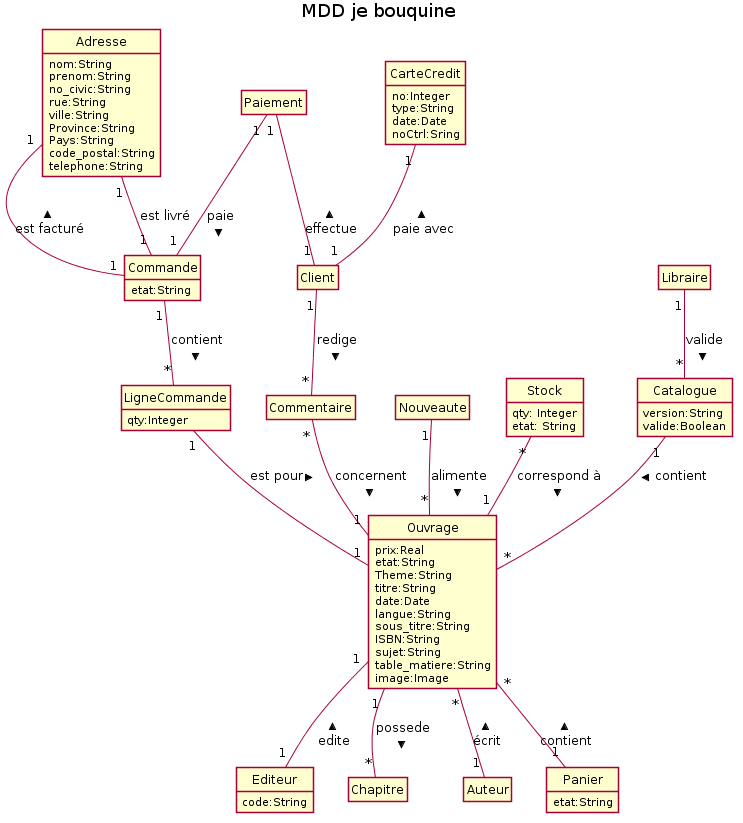{width="6.240740376202974in" height="7.458333333333333in"}

## Diagramme de séquence système (DSS)

### CU01-DSS-Maintenir le catalogue

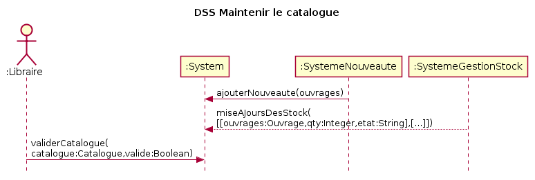{width="6.5in" height="2.1666666666666665in"}

### CU02-DSS-Chercher ouvrage

{width="3.263888888888889in"
height="2.7083333333333335in"}

### CU03-DSS Gérer son panier

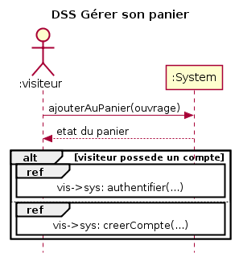{width="3.0833333333333335in" height="3.375in"}

### CU04-DSS Effectuer une commande 

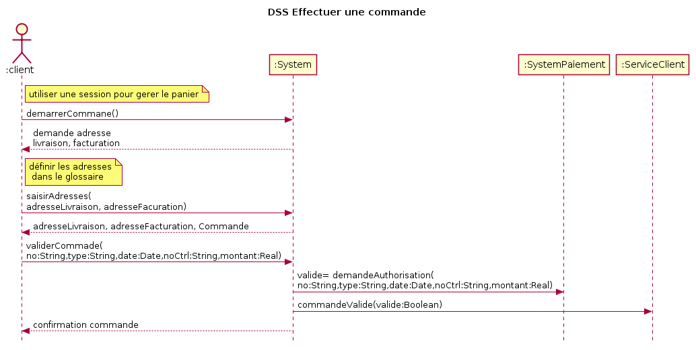{width="6.5in" height="3.263888888888889in"}

## Contrats d'opération

### CU01-contrat-ajouterNouveauté

Opération : ajouterNouveauté(ouvrages)

Préconditions :

Postconditions :

-   Une instance c:Catalogue à été créé

-   C.version est devenu nouvelle version

-   Des instances o:Ouvrage ont été créées

-   o.prix est devenu ouvrage.prix

-   Des associations entre c:Catalogue et o:Ouvrage ont été formées

### CU01-Contrat-miseAJourDesStock 

Opération : miseAJourDesStock(\[\[ouvrage:String,qty:Integer,
etat:String\],\[\...\]\])

Préconditions

-   c:Catalogue existe

Postconditions

-   Des instance s:stock ont été créées

-   s.qty est devenu qty

-   s.etat est devenu état

-   des associations entre o:ouvrage et s:stock ont été créées sur la
    > base de correspondance avec ouvrage

-   

### CU01-contrat- validerCatalogue 

Opération : validerCatalogue(catalogue:String,valide:Boolean)

Préconditions

-   c:Catalogue existe

-   l:Libraire existe

Postconditions

-   c.valide est devenu valide

-   Une association a été créée entre c:Catalogue et l:Libraire

### CU02-contrat- demarrerRecherche 

Opération : demarrerRecherche(texte:String)

-   Aucune postconditioncontrat

### CU02-Contrat-selectionOuvrage

Opération : selectionOuvrage(ouvrage:Ouvrage)

Préconditions :

Postcondition : Aucune

### CU03-contrat ajouterAuPanier 

**Opération : (ouvrage: Ouvrage)**

-   Une association a été créé entre p:Panier et ouvrage:Ouvrage sur la
    > base de correspondence avec ouvrage

### CU04-contrat demarrerCommande 

**Opération : demarrerCommande (p: Panier)**

-   Une instance c:Commande à été créée

-   Des instances ci:CommandeItem ont été créées sur la base de
    > correspondence avec commandeItem de p:Panier

-   Des association ont été créés entre c:Commande et les
    > ci:CommandeItem

-   ~~C.commande a été associé à cl:client~~

-   ~~Des associations entre c:Commande et o:Ouvrage ont été créées sur
    > la base de correspondence des instance de p:Panier~~

-   Les associations entre o:Ouvrage et p:Panier sont détruites

### CU04-contratSaisirAdresses

**opération: SaisirAdresses(adresseLivraison:Adresse,
adresseFacturation:Adresse)**

-   Une instance al:adresse à été créée

-   Tout les attribute de al:Adresse sont devenu égale aux attributs de
    > adresseLivraison.

-   Une instance af:Adresse à été créé

-   Tout les attribute de af:Adresse sont devenu égale aux attributs de
    > adresseFacturation.

-   Une association entre cl:Client et af:Adresse à été créée sur la
    > base de correspondence avec adresseFacturation

-   Une association entre cl:Client et al:Adresse à été créée sur la
    > base de correspondence avec adresseLivraison

-   Une association entre c:Commande et af:Adresse

-   Une association entre c:Commande et al:Adresse

### CU04-contratValiderCommande

opération: ValiderCommande(no:String, date:String)

-   Une instance cc:Carte de credit à été créée

-   Une association entre cl:Client et cc:Carte à été créée

-   Carte.no est devenu no

-   Carte.date est devenu date

##c6.8 Réalisation des cas d'utilisation

### CU01-RDCU-ajouterNouveauté 

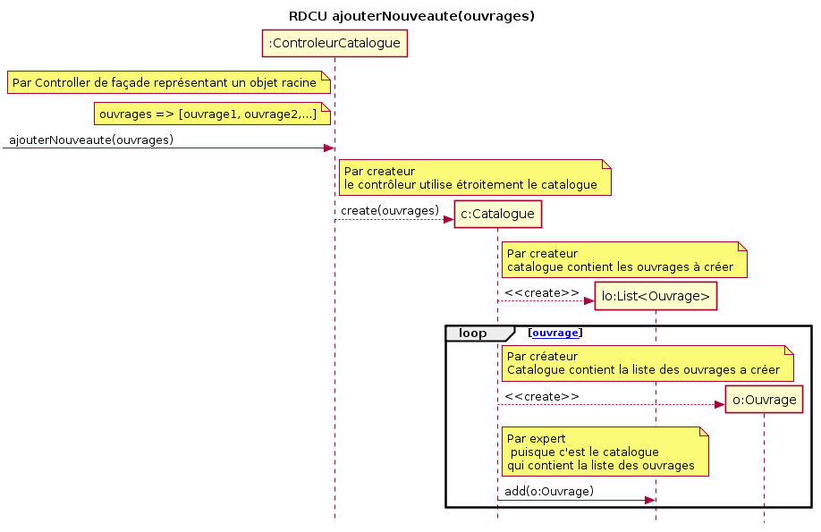{width="6.5in" height="4.208333333333333in"}

### CU01-RDCU-miseAJourDesStock v1

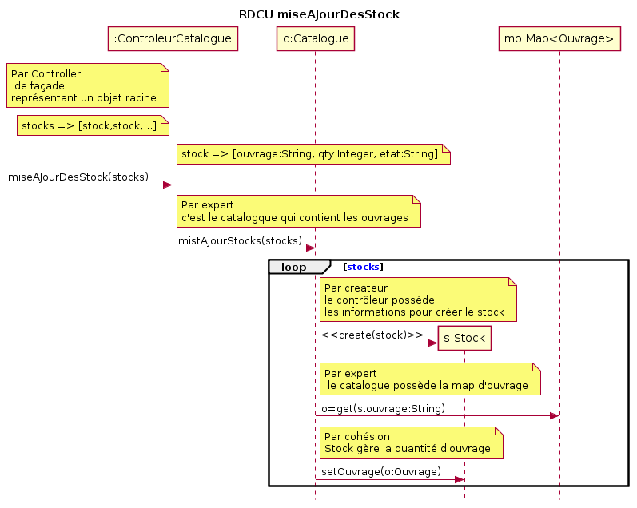{width="6.5in" height="5.180555555555555in"}

### CU01-RDCU- miseAJourDesStock v2

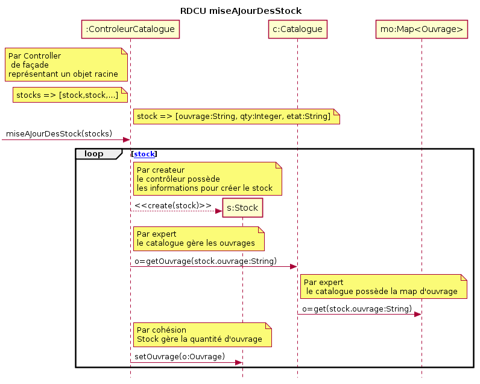{width="6.5in" height="5.180555555555555in"}

### CU01-RDCU- validerCatalogue 

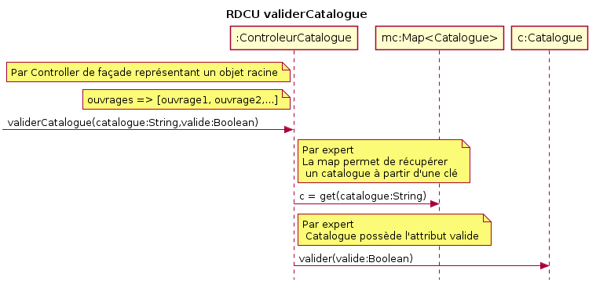{width="6.5in" height="3.138888888888889in"}

### CU02-RDCU- demarrerRecherche

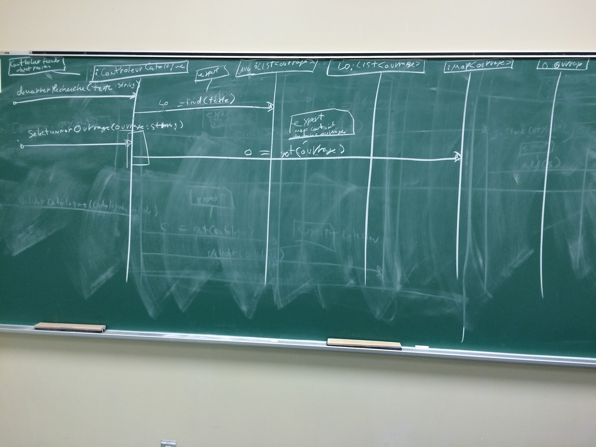{width="6.5in"
height="4.875in"}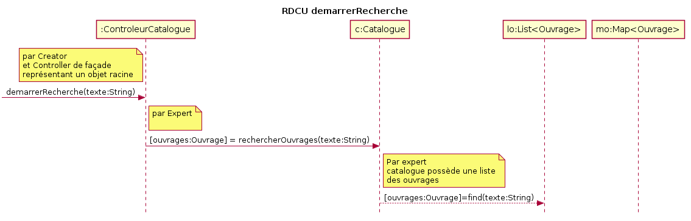{width="6.5in"
height="2.0833333333333335in"}

### CU02-RDCU-selectionOuvrage

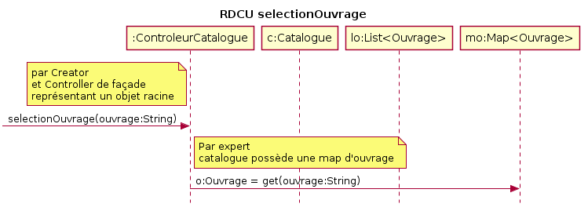{width="6.5in" height="2.3194444444444446in"}

### CU03-RDCU-ajouterAuPanier-V1

> {width="6.48125in"
> height="4.863888888888889in"}

### CU04-RDCUajouterAuPanier-V2 

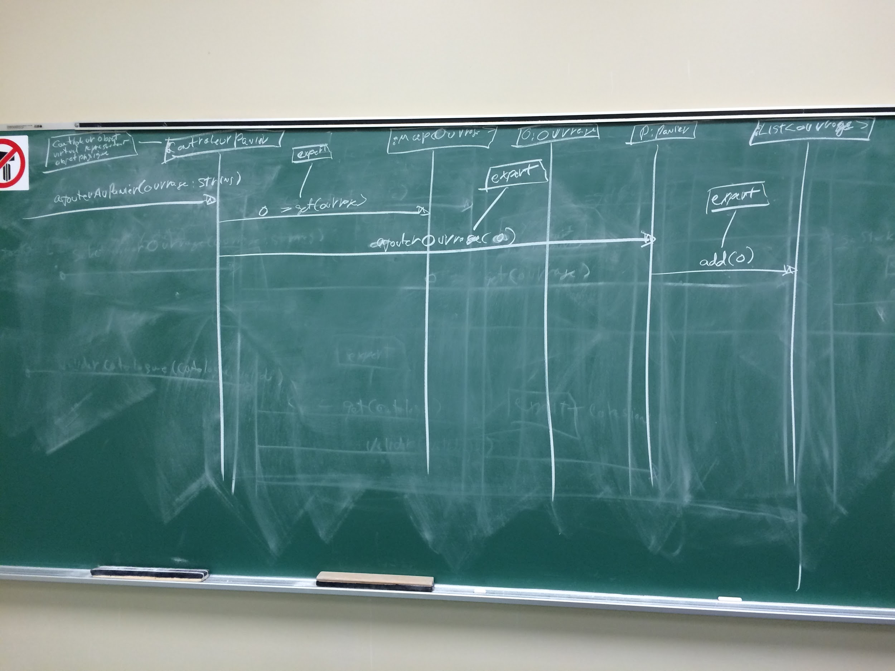{width="6.5in" height="4.875in"}

### CU04-RDCUdemarrerCommande-V0 

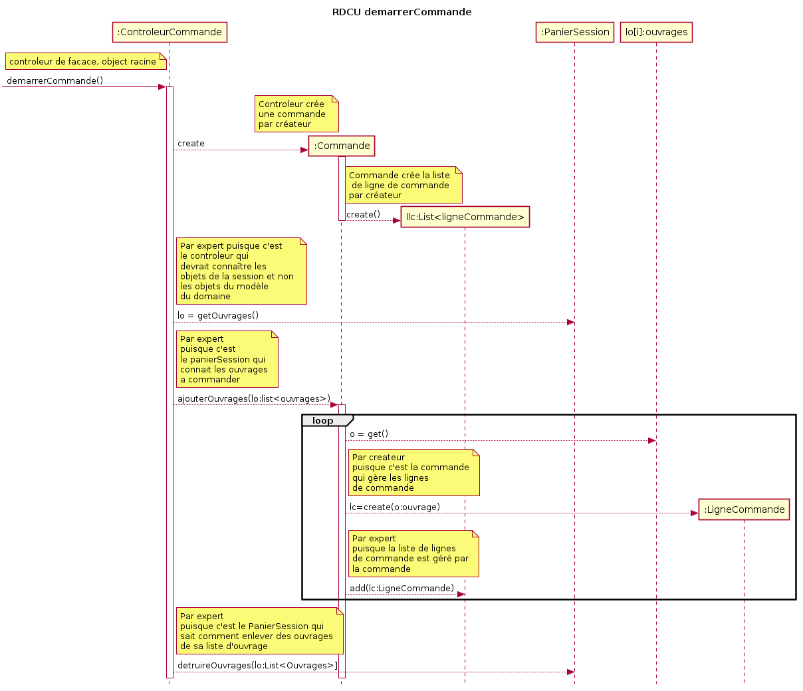{width="6.5in" height="5.583333333333333in"}

### CU04-RDCUdemarrerCommande-V1

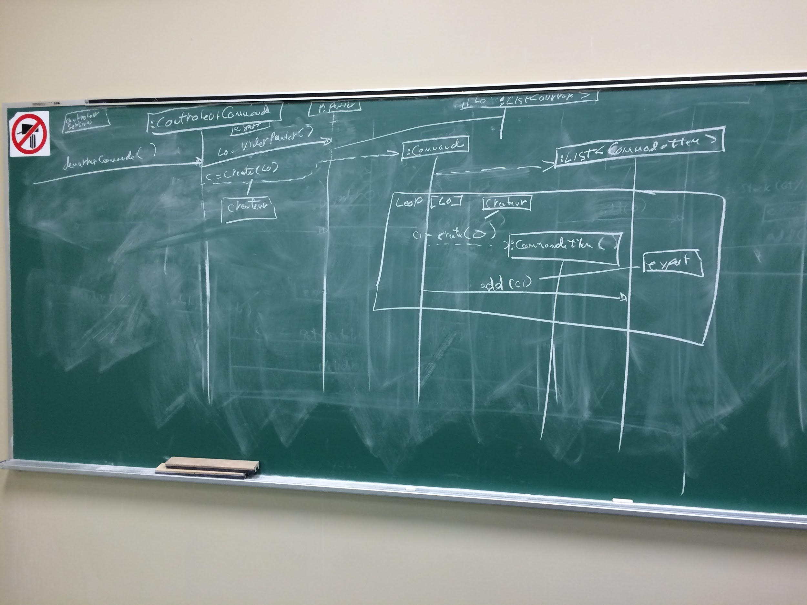{width="6.5in" height="4.875in"}

### CU04-RDCUSaisirAdresses

{width="6.48125in"
height="4.863888888888889in"}

### CU04-RDCUValiderCommande 

**RDCU manquant**
