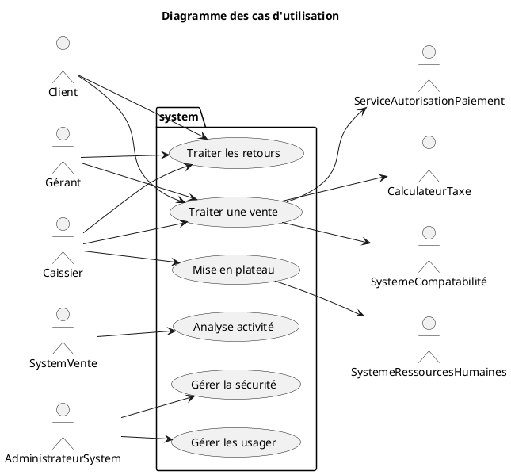
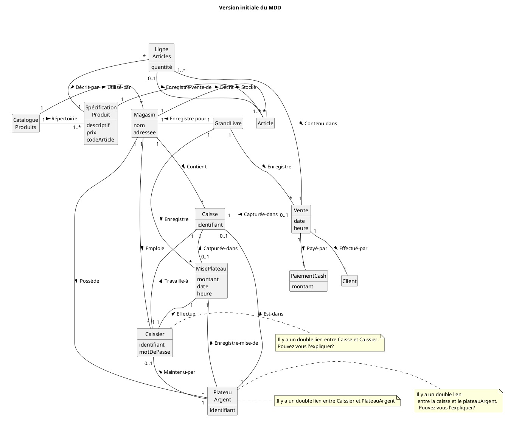
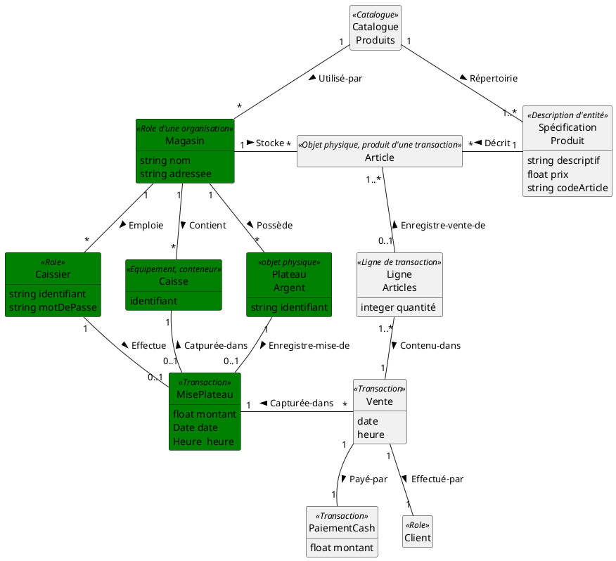
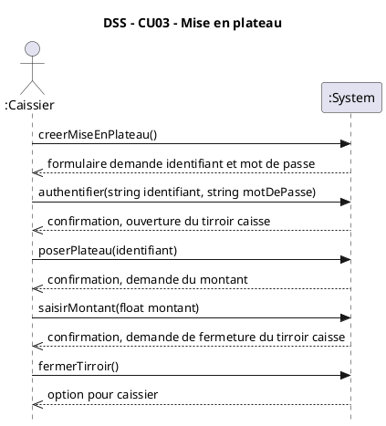
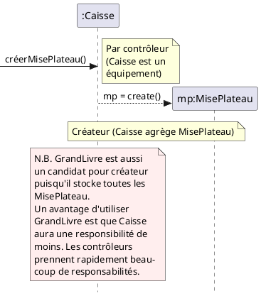
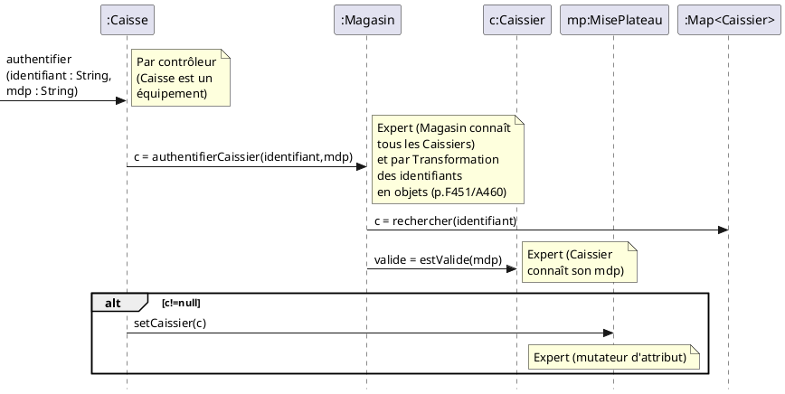
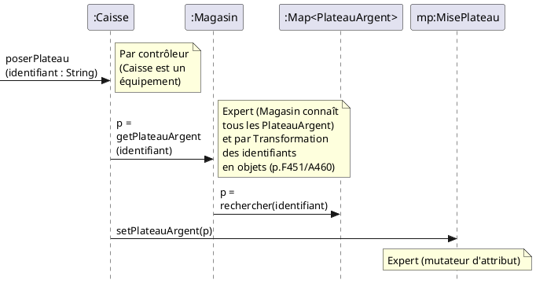
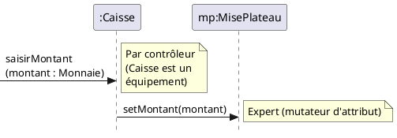
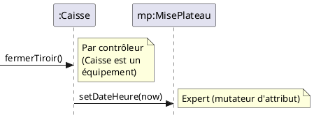
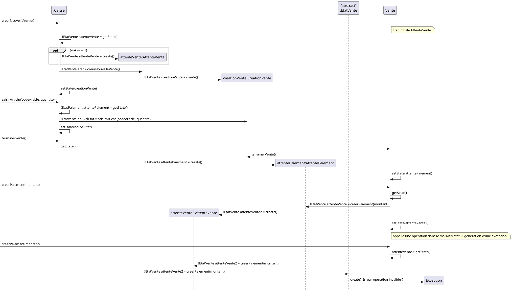

# Système de caisse enregistreuse

## Glossaire
**plateau (plateau d’argent)**
- « Support plat muni de rebords et de compartiments, qui se place à l'intérieur d'un tiroir-caisse et qui sert à garder séparément et à rendre facilement accessibles les différents billets de banque et pièces de monnaie. » [granddictionnaire.com]

**tiroir-caisse**
- Tiroir dans lequel se place le plateau d’argent confié à un caissier.

## CU03-Mise en plateau (Cash in)
**Acteur principal :** Caissier
****Préconditions :****
La caisse est libre et son tiroir-caisse est vide (il n’y a pas de plateau dedans).

**Garanties de succès (postconditions)**
Le caissier est authentifié. Le plateau du caissier est inséré dans le tiroir-caisse et son identificateur est enregistré. Le montant d’argent du plateau est enregistré. L’heure de l’arrivée du caissier est enregistrée.

**Scénario principal (succès)**
1. Le Caissier arrive à la caisse avec son plateau d’argent.
1. Le Caissier saisit son identifiant et son mot de passe.
1. Le Système authentifie le Caissier.
1. Le Système ouvre le tiroir-caisse et demande au Caissier de poser son plateau dans le tiroir-caisse.
1. Le Caissier pose son plateau dans le tiroir-caisse.
1. Le Système reconnaît l’identificateur du plateau.
1. Le Système demande au Caissier de rentrer le montant d’argent du plateau.
1. Le Caissier rentre le montant d’argent du plateau.
1. Le Système demande au Caissier de fermer le tiroir-caisse.
1. Le Caissier ferme le tiroir-caisse.

Pour voir comment un plateau-argent peut être enlevé d’un tiroir-caisse, regarder cette vidéo sur YouTube : https://goo.gl/9HdKNq

## MDD's

### nettoyage du MDD pour enlever les liens/classes inutiles/redondants

###  Contrat CU03-créerMisePlateau
**Opération :**	créerMisePlateau ()
**Références croisées :**	Cas d’utilisation : Cash In
**Préconditions :**
- Aucune
  
**Postconditions :**
- une instance mp de MisePlateau a été créée.

### Contrat CU03-authentifier
**Opération :**	authentifier (identifiant : String, mdp : String)
**Références croisées :**	Cas d’utilisation : Cash In
**Préconditions :**
- Il existe une mise plateau en cours.

**Postconditions :**
- mp a été associé à un Caissier, sur la base de correspondance avec identifiant.
- ca.ouvert est devenu vrai
- 
### Contrat CU03-poserPlateau
**Opération :**	poserPlateau (identifiant : String)
**Références croisées :**	Cas d’utilisation : Cash In
**Préconditions :**
- Il existe une mise plateau en cours.

**Postconditions :**
- mp a été associé à un PlateauArgent, sur la base de correspondance avec identifiant.

### Contrat CU03-saisirMontant
**Opération :**	saisirMontant(montant : Float)
**Références croisées :**	Cas d’utilisation : Cash In
**Préconditions :**
- Il existe une mise plateau en cours.
  
**Postconditions :**
- mp.montant est devenu montant.

### Contrat CU03-fermerTiroir
**Opération :**	fermerTiroir()
**Références croisées :**	Cas d’utilisation : Cash In
**Préconditions :**
- Il existe une mise plateau en cours.
  
**Postconditions :**
- mp.date est devenue la date actuelle.
- ca.ouvert est devenu faux
- mp.heure est devenue l’heure actuelle.

### RDCU CU03-créerMisePlateau

### RDCU CU03-authentifier-V1

### RDCU CU03-poserPlateau

### RDCU CU03-saisirMontant

### RDCU CU03-fermerTiroir

### DCL à faire

# CU04 - Traiter une vente

