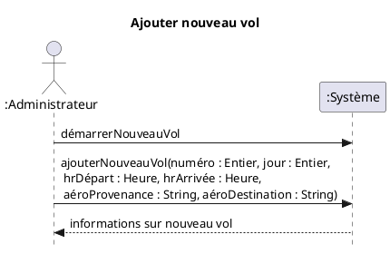

# Compagnie aérienne
Référence: Roques, Pascal (2009). UML par la pratique. Eyrolles. Pascal Roques a travaillé avec Craig Larman à l’entreprise Valtech. Ils ont utilisé des méthodologies OOA/D très similaires et ce livre est une source d’autres exemples intéressants. 

## CU01-Ajouter nouveau vol
**Préconditions:** L’administrateur est identifié et authentifié. 
**Scénario principal:**
1.	L’administrateur démarre l’ajout d’un vol dans la compagnie aérienne.
2.	L’administrateur saisit le numéro du vol, le jour de la semaine, l’heure de départ, l’heure d’arrivée, <s>la période de validité</s>, l’aéroport de départ et l’aéroport de destination. 
3.	Le système affiche les informations du nouveau vol.
Modèle du domaine (MDD)

## CU01-MDD-Ajouter nouveau vol
Voici un exemple  d’un modèle du domaine pour un système de gestion de vols et de réservations.
 

Diagramme de séquence système (DSS)
CU01-DSS-Ajouter nouveau vol

 

 

### Contrats d’opération
CU01-Contrat-Ajouter nouveau vol

