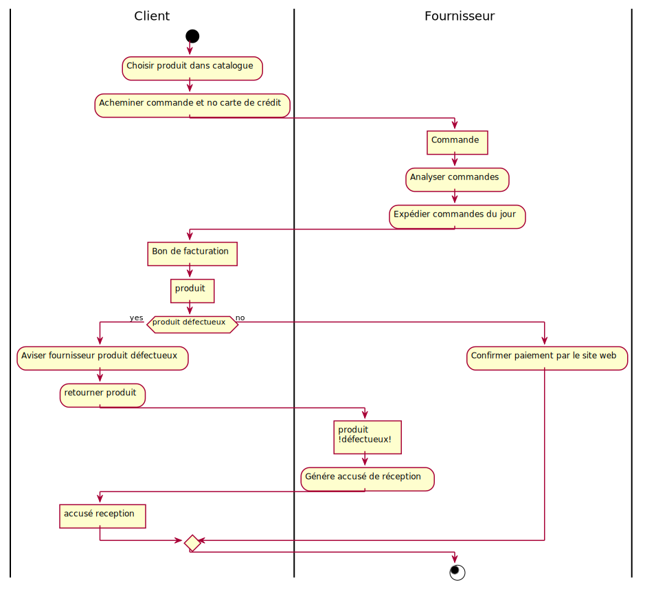
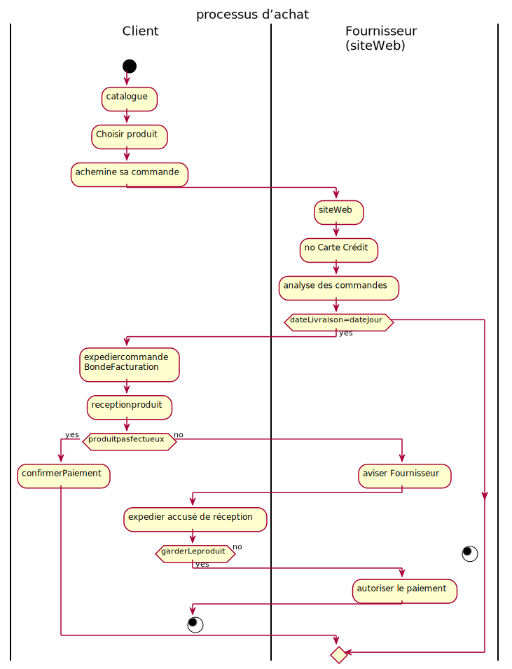
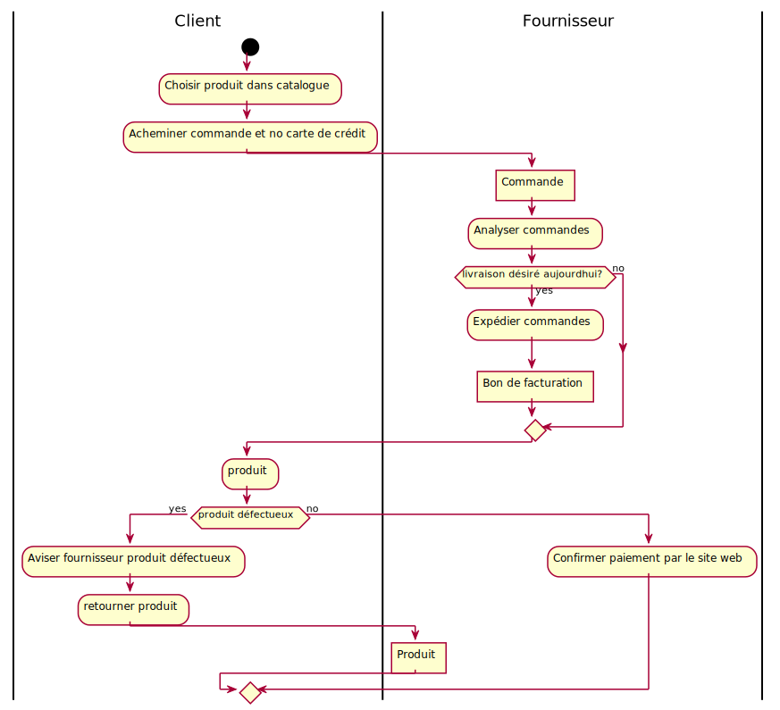
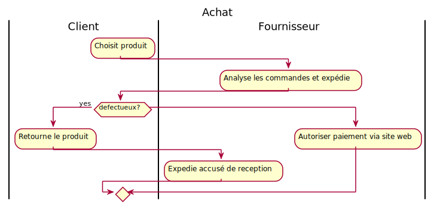

## Processus d\'achat sur le Web

Modéliser à l'aide d'un diagramme d'activités en utilisant la
représentation sous forme de couloirs d'activités, un processus d'achat
faisant intervenir un client désireux de se procurer un produit et un
fournisseur désireux de lui vendre le produit. Le client choisit son
produit par catalogue. Il achemine sa commande via le site Web du
fournisseur et indique son no. de carte de crédit. Le fournisseur
analyse ses commandes et expédie dans la journée même toutes les
commandes dont la date de livraison désirée est égale à la date du jour
et il y joint le bon de facturation. À la réception du produit, le
client confirme son paiement via le site Web ou si le produit est
défectueux, avise le fournisseur, via le site Web qu'il lui retourne le
produit. En cas de défectuosités, le client retourne le produit au
fournisseur et lors de la réception du colis, le fournisseur lui expédie
un accusé de réception. Si le client garde le produit, il doit en
autoriser le paiement via le site Web (voir solution Sylvie).

## Solution 1

## solution 2

## Solution 3

## Solution 4

