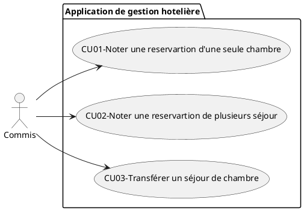
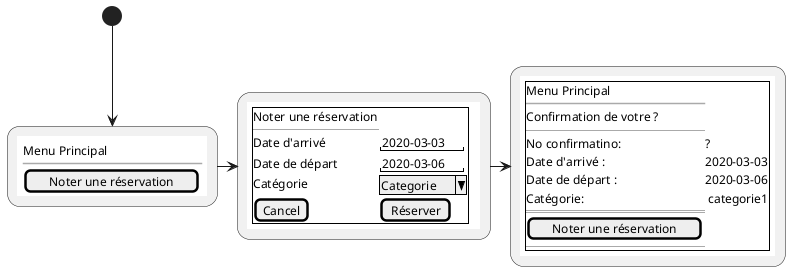
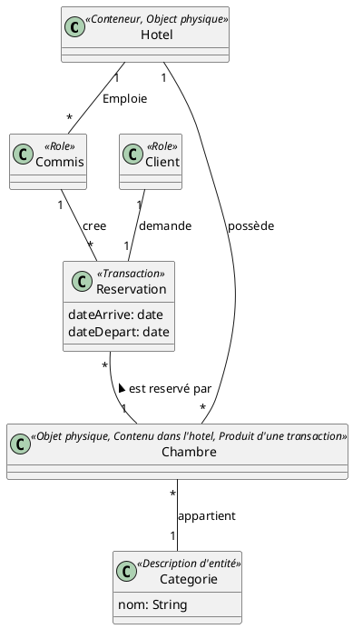
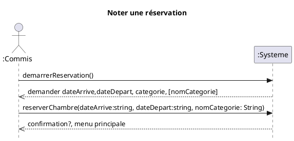
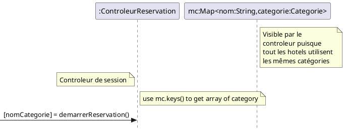
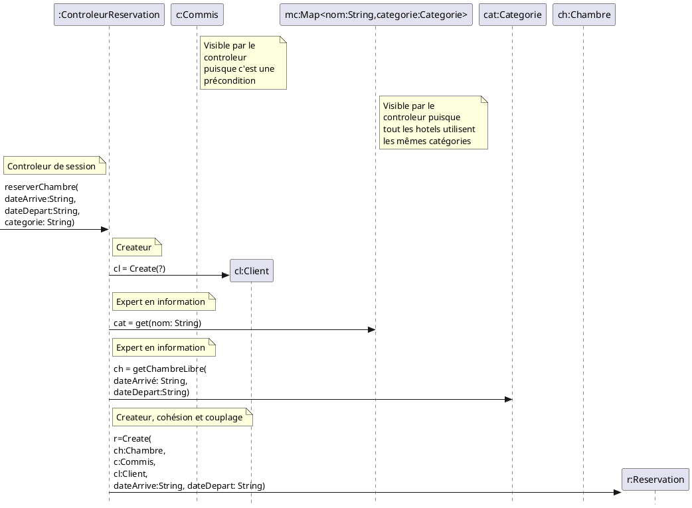
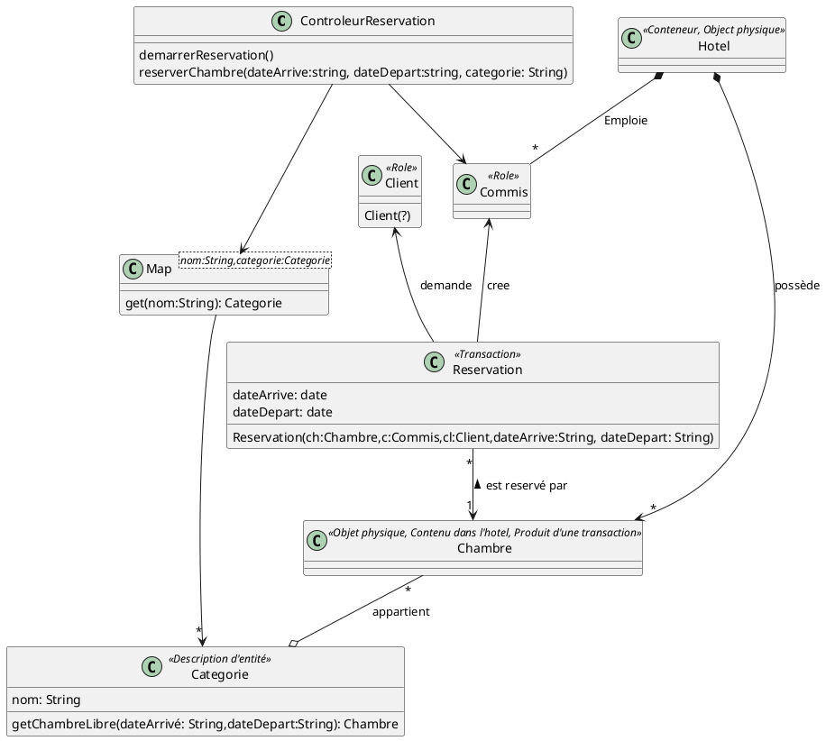

#CU01 - Noter une réservation

## Diagramme de cas d'utilisation

## Cas d'utilisation «Noter une réservation»

Scénario principal

1. Un client appelle à l'hôtel pour placer une réservation.
1. Le commis démarre une nouvelle réservation.
1. Le commis entre:
   1. La date d'arrivée;
   2. La date de départ;
        3. Le nom de la catégorie de chambre;
2. Le système inscrit les informations à la réservation.

## Interfaces usagé

## Modèle du domaine

## Diagramme de séquence système

## Contrat
**demarrerReservation()**
  - aucune

  **reserverChambre(dateArrive:string, dateDepart:string, nomCategorie: String)**
  - Précondition:
    - c:Commis est authentifier

  - Postcondition
    - Une instance r:Reservation a été créé
    - Une association a été créée entre r:Reservation et Chambre sur la base de correspondance avec categorie.nom == nomCategorie
    - Une association a été cree entre c:Commis et r:Reservation
    - Une instance cl:Client a été créée (? Nom, Prénom, Courriel)
    - Une association entre r:Reservation et cl:Client a été créée
    - r.dateArrivé est devenu dateArrivé
    - r.dateDepart est devenu dateDepart

## RDCU

### demarrerReservation()

### reserverChambre

## Diagramme de classe

### CU01-Exercices-Notez une réservation
1. Représentez le fait qu’un Client est responsable d’une Réservation.
1. Représentez le fait qu’une Réservation peut avoir plusieurs Ligne de Réservation.
1. Représentez le fait qu’une Catégorie de chambre regroupe plusieurs Chambres.
1. Est-il nécessaire d’associer un Client à une Chambre? Justifiez la réponse.
1. Représentez le fait qu’un Client désire occuper une Chambre d’une catégorie précise 1. durant la première fin de semaine de mois de juillet. Justifiez les associations à 1. l’aide d’un verbe exprimant la raison d’être de l’association. Indiquez les 1. attributs des classes conceptuelles.
1. Représentez le fait qu’un Commis a confirmé la Réservation à l’Agenda à l’aide des 1. informations personnelles (nom et numéro de téléphone) du Client. Justifiez les 1. associations à l’aide d’un verbe d’action. Indiquez les attributs nécessaires.
1. Bâtissez le modèle du domaine partiel du système de l’hôtel. Justifiez les 1. associations à l’aide d’un verbe. Indiquez tous les attributs pertinents

### CU01-CU02-Exercices-RDCU

1. 	Proposez une solution logicielle, sous forme de diagramme dynamique, permettant d’instancier une réservation. Annotez votre solution des principes GRASP.
 
2. 	Proposez une solution logicielle, sous forme de diagramme dynamique, permettant d’instancier une ligne de réservation. Annotez votre solution des principes GRASP.
 
3. 	Proposez une solution logicielle, sous forme de diagramme dynamique, permettant d’associer une ligne de réservation à une catégorie de chambre. Annotez votre solution des principes GRASP.
 
4. 	Proposez une solution logicielle, sous forme de diagramme dynamique, permettant de stocker une réservation dans l’agenda. Annotez votre solution des principes GRASP.
 
5. 	Proposez une solution logicielle, sous forme de diagramme dynamique, permettant de repérer une réservation à partir de son numéro de confirmation. Annotez votre solution des principes GRASP.
 
 6. 	Proposez une solution logicielle, sous forme de diagramme dynamique, permettant de créer un client tout en l’associant à une nouvelle réservation. Annotez votre solution des principes GRASP.
 
7. 	Proposez une solution logicielle, sous forme de diagramme dynamique, permettant de détruire une réservation appartenant à un client. Annotez votre solution des principes GRASP.
 
8. 	Proposez une solution logicielle, sous forme de diagramme dynamique, permettant d’imprimer une facture incluant l’information sur une réservation, ses lignes de réservation et les catégories de chambres associées.  Annotez votre solution des principes GRASP.
