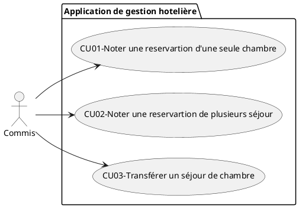
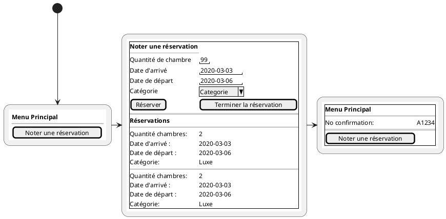
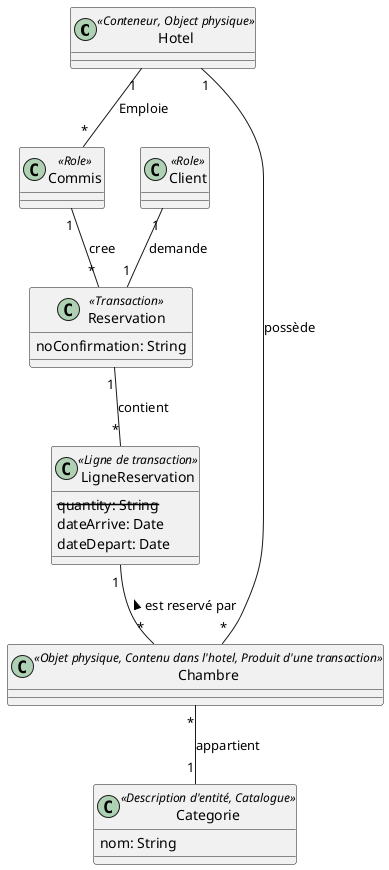
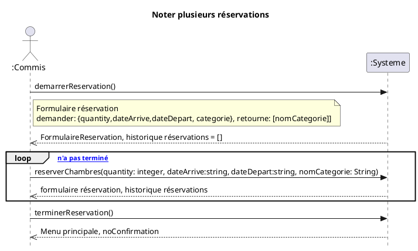
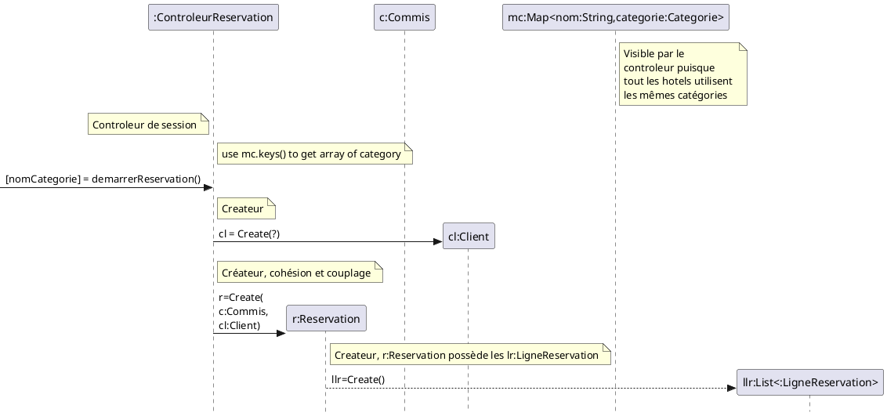
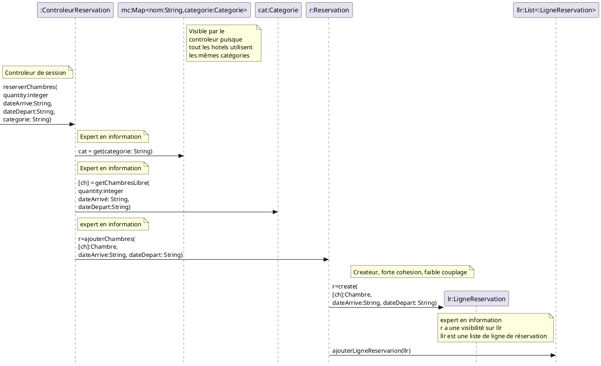
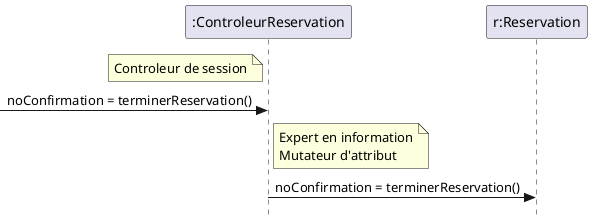
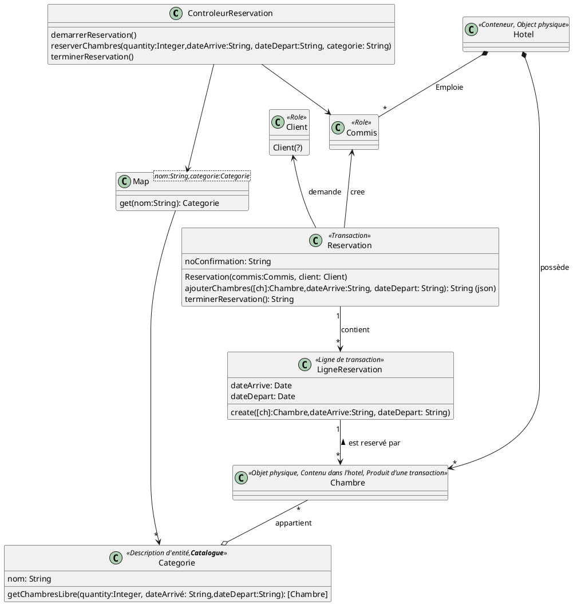

#CU02 - Noter une réservation avec plusieurs chambres

## Diagramme de cas d'utilisation

## CU02 - Cas d'utilisation 
### CU02-Noter une réservation avec plusieurs chambres
**Pré(s) condition(s) :**
- Le commis est authentifié.
  
**Post condition(s) :**
- Une réservation est inscrite

**Acteur principal:**
- Le commis à la réception (commis).

**Scénario principal**
1. Un client appelle à l'hôtel pour placer une réservation.
1. Le commis démarre une nouvelle réservation.
1. Le commis entre:
   1. La date d'arrivée;
   2. La date de départ;
   3. Le nom de la catégorie de chambre;
   4. La quantité de chambres.
1. Le système inscrit les informations à la réservation.

Les étapes 3 et 4 sont répétées tant que le client n'indique pas qu'il a terminé.

5. Le commis termine la réservation.
1. Le système affiche toutes les informations entrées.
1. Le commis valide les informations auprès du client et confirme la réservation à l'aide du nom et du numéro de téléphone du client.
1. Le système enregistre la réservation et affiche le numéro de confirmation.
1. Le commis communique le numéro de confirmation au client.

**Scénarios alternatifs**
*. En tout temps, le commis annule la réservation.
  1. Le système supprime la réservation.
  2. Fin du cas d'utilisation.

3a. Il n'y a pas assez de chambres de la catégorie choisie pour la période entrée.
  1. Le système affiche un message d'avertissement.
  1. Le système affiche les disponibilités de toutes les catégories pour la période entrée.
  1. Le commis communique les disponibilités au client.
  1. Retour à 3.

#### CU02-Réservation simple
Jean Hernandez appelle à l'hôtel pour réserver une chambre.
Le commis entrera:
Le 2011-06-01 comme date d'arrivée
Le 2011-06-02 comme date de départ
"Luxe" comme catégorie de chambre
1 pour la quantité
Le commis terminera ensuite la réservation et communiquera le numéro de confirmation à monsieur Hernandez.

#### CU02-Réservation d'affaires
Jean Hernandez appelle à l'hôtel pour réserver deux chambres identiques, mais pour des périodes légèrement différentes. Son collègue, Patrice Retardataire, arrivera une journée après Jean.
Le commis entrera d'abord:
2011-08-02 comme date d'arrivée
2011-08-07 comme date de départ
"Standard" comme catégorie de chambre
1 pour la quantité
Puis, il entrera:
2011-08-03 comme date d'arrivée
2011-08-07 comme date de départ
"Standard" comme catégorie de chambre
1 pour la quantité
Le commis terminera ensuite la réservation et communiquera le numéro de confirmation à monsieur Hernandez.

#### CU03-Réservation budgétaire
Jean Hernandez planifie des vacances avec son fils. Il appelle à l'hôtel pour réserver deux chambres de catégorie différente pour la même période.
Le commis entrera d'abord:
2011-07-10 comme date d'arrivée
2011-07-18 comme date de départ
"Luxe" comme catégorie de chambre
1 pour la quantité
Puis, il entrera:
2011-07-10 comme date d'arrivée
2011-07-18 comme date de départ
"Standard" comme catégorie de cham¬
Le commis terminera ensuite la réservation et communiquera le numéro de confirmation à monsieur Hernandez.

## Interfaces usagé

## Modèle du domaine

Cette version sous entends que les Catégories sont les même pour tous les Hotels.  Si ce   n’étais pas le cas, on associe Hotel à Catégorie et on enlève l’association entre Hotel et Chambre.

Catégorie peut être traité comme une classe de description ou un catalogue selon le sens par lequel nous utilisons les classes.  
Plusieurs chambres sont décrite par une catégorie (Classe de description)
Une Catégorie (Catalogue) contient plusieurs Chambre.

## Diagramme de séquence système

## Contrat
**demarrerReservation()**
 - Précondition:
    - c:Commis est authentifier
  - 
  - Postcondition
    - Une instance r:Reservation a été créée
    - Une association a été cree entre c:Commis et r:Reservation
    - Une instance cl:Client a été créée (? Nom, Prénom, Courriel)
    - Une association entre r:Reservation et cl:Client a été créée

  **reserverChambres(quantity: integer, dateArrive:string, dateDepart:string, nomCategorie: String)**
  - Précondition:
    - c:Commis est authentifier
    - r:Reservation existe

  - Postcondition
    - Une instance lr:LigneReservation a été créé
    - Une association a été créée entre r:Reservation et lr:LigneReservation
    - <u>quantity</u> associations ont été créées entre lr:LigneReservation et Chambre sur la base de correspondance avec categorie.nom == <u>nomCategorie</u>
    - lr.dateArrivé est devenu <u>dateArrivé</u>
    - lr.dateDepart est devenu <u>dateDepart</u>

**terminerReservation()**
  - Précondition:
    - r:Reservation existe

  - Postcondition
    - r.noConfirmation est devenu un numéro unique

## RDCU

### demarrerReservation()

### reserverChambres

### terminerReservation

## Diagramme de classe

