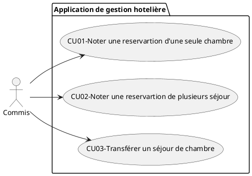
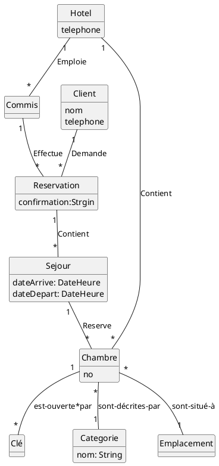
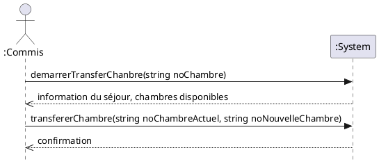
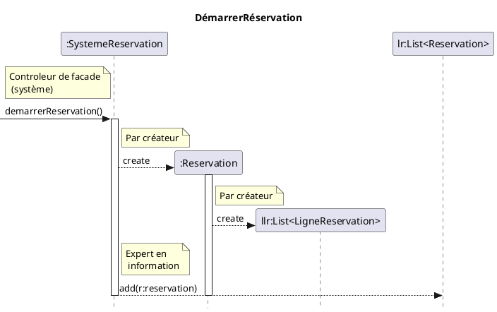
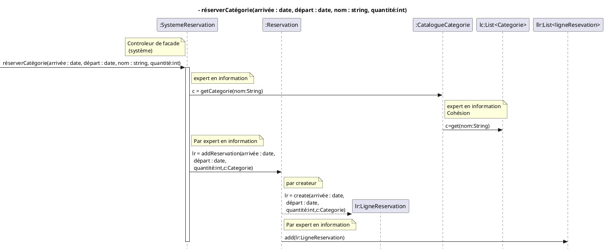

### CU03-Transférer un séjour de chambre

### CU03-Transférer un séjour de chambre
**Précondition(s) :**
- Le commis est authentifié.

**Postcondition(s) :**
- Le séjour se poursuit dans une autre chambre.

**Acteur principal :** Le commis à la réception

**Scénario principal**
1. Un client désire occuper une chambre différente pour le reste de son séjour.
1. Le commis entre le numéro de chambre dans laquelle le client séjourne.
1. Le système affiche le séjour ainsi que toutes les chambres disponibles de la même catégorie.
1. Le commis informe le client des chambres disponibles puis sélectionne celle que le client préfère.
1. Le système modifie la ligne courante du séjour et inscrit une nouvelle ligne au séjour pour la nouvelle chambre.
1. Le commis remet la clé de la chambre au client et lui indique l'emplacement de la chambre dans l'hôtel.

**Scénarios alternatifs**
3a. Il ne reste plus de chambres disponibles dans la catégorie réservée.
Le système affiche les chambres disponibles pour toutes les catégories.
Retour à 4

## MDD CU01 + CU02 + CU03
LigneRéservation correspond à Sejour. Il faut aussi modifier les multiplicité entre Séjour et Chambre pour 1 – 1. 

## DSS CU03-Transférer un séjour de chambre

### Contrat CU03-demarrerTransfert
**Opération:** demarrerTransfer(numeroChambre)
**Présconditions:**
**Postconditions:**
- Aucune

### Contrat CU03-transférerChambre
**Opération:** transférerChambre(noChambreActuel, noNouvelleChambre)
**Présconditions:**
**Postconditions:**
- Une instance sn:Sejour a été créée
- sn.dateArrive est devenu maintenant
- sn.dateDepart est devenu Chambre.sejour.dateDepart sur la base de correspondance avec noChambreActuel
- Une association a été créée entre sn et Chambre.sejour.réservation sur la base de correspondance avec noChambreActuel
- Une association a été créée entre sn et Chambre sur la base de correspondance avec noNouvelleChambre
- Chambre.Sejour.dateDepart et devenu maintenant sur la base de correspondance avec noChambreActuel

### RDCU CU03-demarrerTransfert

### RDCU CU03-transférerChambre

