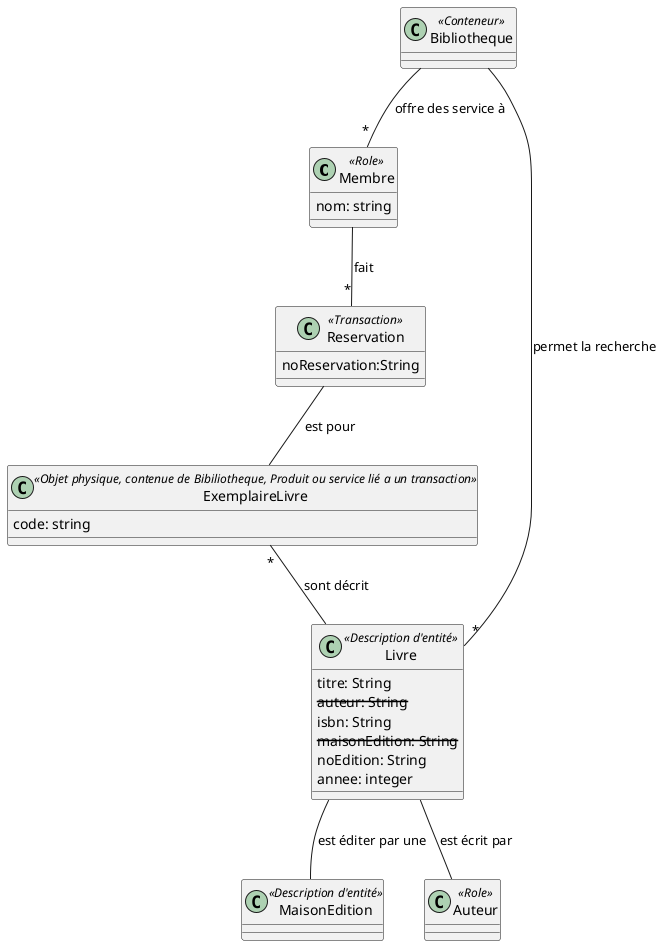
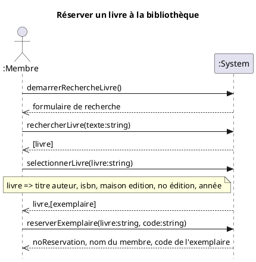
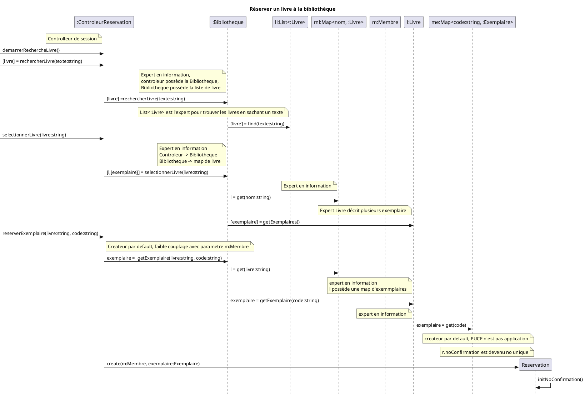
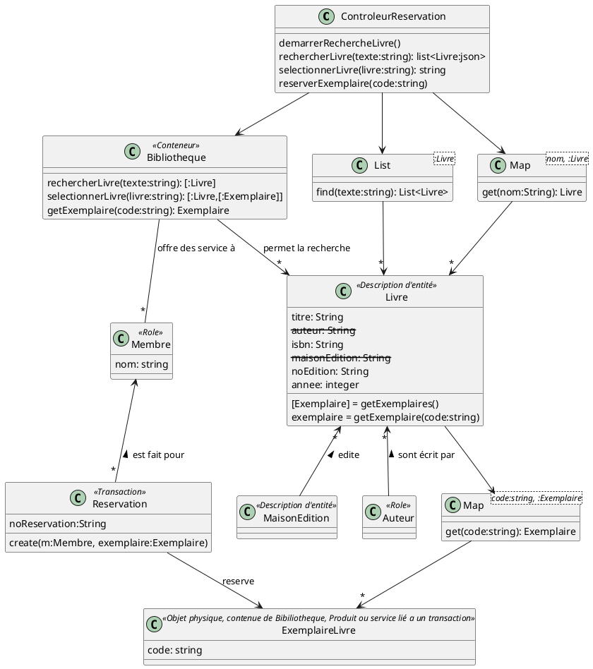

# Réserver un livre à la bibliotheque
https://drive.google.com/file/d/1wclLv1Zt32XfMATWVzaEcqPBaql8ULXd/view

# MDD

# DSS

# Contrats

## operation: demarrerRechercheLivre()
**- Prédondition**
**- Postcondition**
  - Aucune

## operation: rechercherLivre(livre:string)
**- Prédondition**
**- Postcondition**
 - Aucune

## operation: selectionnerLivre(livre:string)
**- Prédondition**
**- Postcondition**
 - Aucune

## operation: reserverExemplaire(livre:string, code:string)
**- Prédondition**
  - m:Membre est authentifier

**- Postcondition**
  - Une instance de r:Reservation a été créée
  - Une association a été créée entre m:Membre et r:Reservation
  - Une association a été créée entre r:Reservation et Exemplaire sur la base de correspondance avec Exemplaire.code
  - r.noConfirmation est devenu un no unique (spécifier le format dans le glossaire)

# RDCU

# DCC - DCL
