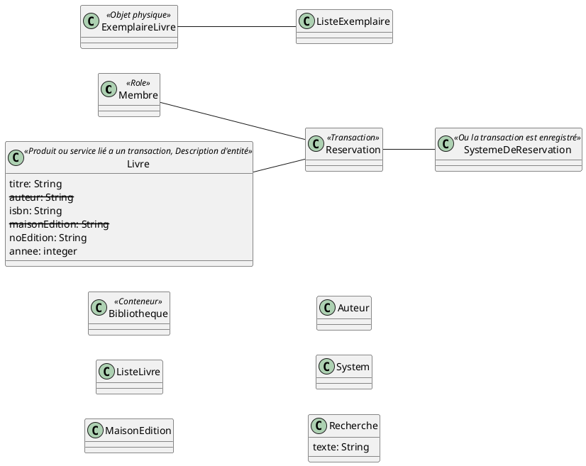

# Réserver un livre à la bibliotheque
https://drive.google.com/file/d/1wclLv1Zt32XfMATWVzaEcqPBaql8ULXd/view

## Solution d'un étudiant

```plantuml
@startuml
left to right direction
class M as "Membre" <<Role>>

class B as "Bibliotheque" <<Conteneur>>
class L as "Livre" <<Produit ou service lié a un transaction, Description d'entité>>   {
  titre: String
  <s>auteur: String</s>
  isbn: String
  <s>maisonEdition: String</s>
  noEdition: String
  annee: integer
} 
class ListeExemplaire
class ListeLivre
class ME as "MaisonEdition" 
class A as "Auteur"
class S as "System"
class SystemeDeReservation <<Ou la transaction est enregistré>>
class EL as "ExemplaireLivre" <<Objet physique>>
class R  as "Reservation" <<Transaction>>
class Recherche {
  texte: String
}


L -- R
M -- R
R -- SystemeDeReservation
EL -- ListeExemplaire
@enduml
```
